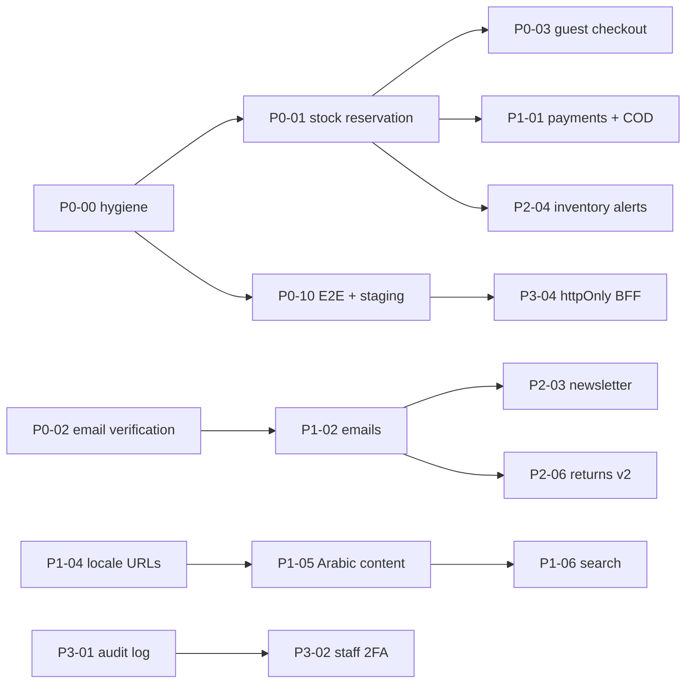

# TrendVaulta — Production Readiness Implementation Plan

| | |
|---|---|
| **Baseline** | `main` @ `3dc0308` (2026-09-29) |
| **Source** | Requirements-engineering gap analysis of the monorepo, cross-checked against the code, plus the open items from the 2026-09-27 technical audit (94 open / 16 partly fixed findings after phases A and B) |
| **Goal** | Take the store from "feature-rich and hardened" to "a store the business can run on": no lost orders, no invisible failures, correct for the target market, and accountable admin actions |
| **Companion** | [IMPLEMENTATION_PROMPT.md](IMPLEMENTATION_PROMPT.md) — the prompt used to execute this plan one task at a time |
| **Reference** | [PROJECT_REFERENCE.md](PROJECT_REFERENCE.md) — setup, API surface, data model, security model, business rules |

---

## 0. How to use this plan

1. Work **one task at a time**, in ID order inside a phase, unless the dependency column says otherwise.
2. A task marked **⛔ Decision** must not start until the decision in [§2](#2-decisions-required-before-work-starts) is recorded. If you must start, use the stated default and write it down in the task's status line.
3. One task = one branch (`feature/<id>-<slug>` or `fix/<id>-<slug>`) = one or more focused commits. Never mix two task IDs in one commit.
4. A task is done only when every item in its **Acceptance criteria** and the global [Definition of Done](#8-definition-of-done-applies-to-every-task) are met.
5. When a task is finished, update its row in the [tracking table](#9-tracking-table) (status, date, commit) in the same PR.

**Status legend:** ⬜ Not started · 🟦 In progress · ✅ Done · 🟡 Partly done (say what is left) · ⏸ Blocked (say on what)

**Priority:** **P0** blocks launch · **P1** needed for the target market · **P2** completes an existing feature · **P3** governance / compliance · **P4** growth

**Effort:** **S** ≤ 1 day · **M** 2–4 days · **L** 1–2 weeks

---

## 1. System context and non-negotiable invariants

**Stack:** npm-workspaces monorepo.

| App | Tech | Role |
|---|---|---|
| `apps/api` | Express 5, Mongoose 8, Stripe, Joi, pino | Source of truth for price, stock, tax, shipping, payment state and roles |
| `apps/website` | Next.js 16, React Query, Tailwind | Storefront, EN/AR with RTL, locale in the `tv_locale` cookie |
| `apps/dashboard` | Vite, React, React Query, Radix | Staff admin (roles `admin`, `moderator`) |

**Invariants — every task must preserve these. A change that breaks one is rejected, whatever it fixes.**

| # | Invariant | Where it lives today |
|---|---|---|
| I-1 | The server computes price, discount, stock, tax, shipping and payment state. The client only sends intent. | `utils/commerce.js`, `payment.controller.js` |
| I-2 | An order becomes `paid` only through the Stripe webhook or `verify-payment`, never from a client write or redirect. | `payment.controller.js` |
| I-3 | Paid-path side effects (stock, coupon use, email) run exactly once, through the lease flags on `Order`. | `leaseOrderFlag` / `releaseOrderFlag` |
| I-4 | Webhooks are signature-verified and de-duplicated by `eventId`. | `utils/stripeWebhookIdempotency.js` |
| I-5 | Registration always forces `roles: ['user']`. No client-driven role elevation. | `auth.controller.js` |
| I-6 | Every customer resource is ownership-scoped by the JWT subject. | controllers |
| I-7 | Money is rounded to cents at every step. | `utils/commerce.js` |
| I-8 | Products, brands and users are never hard-deleted (soft delete / anonymise). | B6 remediation |
| I-9 | Every UI string exists in both `messages/en.json` and `messages/ar.json`. RTL uses logical Tailwind classes only (`ms/me/ps/pe`, `start/end`). | `apps/website/src/messages` |
| I-10 | No new runtime dependency without explicit approval, recorded in the task's status line. | — |

---

## 2. Decisions required before work starts

| ID | Question | Blocks | Default if nobody decides |
|---|---|---|---|
| **D1** | Target market (countries) and payment methods: Stripe only, or also cash on delivery (COD) and/or a regional gateway (Tap, HyperPay, Moyasar, PayTabs)? | P1-01, P1-04 | Keep Stripe. Build the provider abstraction and COD behind a store setting that is **off** by default. |
| **D2** | Allow guest checkout? | P0-03 | Yes, email required, with an optional "create account" step after payment. |
| **D3** | Should moderators be able to change product prices (`products:write`) and see marketing PII? | P3-03 | No. Split `products:write` into `products:write` (content) and `products:price`. Price is admin-only. |
| **D4** | How many proxy hops sit between Vercel and Render? Will the API run more than one instance? | P0-09 | `trust proxy = 1`. Use a shared store (MongoDB TTL collection) so that more than one instance is safe. |
| **D5** | Email-verification policy: block checkout until verified, or show a soft banner only? | P0-02 | Soft banner plus verification required **before a review or return request**. Existing accounts are grandfathered as verified. |
| **D6** | Tax rules: per country or zone? Charged before or after the discount? Prices shown tax-inclusive? | P1-03 | Per shipping zone, after the discount, prices tax-exclusive (the current behaviour). |
| **D7** | Is the Atlas cluster on a tier with backups? What RPO/RTO is acceptable? | P0-08 | Paid tier with daily snapshots; RPO 24 h, RTO 4 h. |
| **D8** | Error tracking vendor and DSNs (Sentry or equivalent), and dependency approval. | P0-06 | Sentry, one project per app. |

Record answers here (date + who), for example: `D2 — Yes, guest checkout — 2026-10-01 — owner`.

---

## 3. Phase 0 — Launch blockers (P0)

> Exit criteria for Phase 0: a real customer can buy, the business can see and answer every order and message, nothing is lost on a redeploy, and a failure in production pages someone.

### P0-00 · Fix the API test command on Windows and repo hygiene
**Priority** P0 · **Effort** S · **Depends on** —

**Problem.** `apps/api/package.json` wraps its globs in single quotes: `node --test app.test.js 'utils/**/*.test.js' …`. `cmd.exe` doesn't strip single quotes, so on Windows `npm run test:api` runs **1 test instead of the full suite** and reports success. CI on Linux is not affected.

Also:
- The last commit deleted `docs/audit/*`, but `docs/PROJECT_REFERENCE.md` (§6 data model) still links to `docs/audit/AUDIT_REPORT.md`.
- `packages/types` is built but nothing imports it.

**Scope.**
1. Change the test globs to double quotes, which both `cmd.exe` and POSIX shells handle, and Node's built-in glob expands them itself.
2. Fix the dangling audit references in `PROJECT_REFERENCE.md`: link the git commit that holds the audit, or restore the file under `docs/audit/`.
3. Add a CI step that fails when `en.json` and `ar.json` have different key sets (a small Node script in `apps/website/scripts/`).
4. Decide on `packages/types`: remove it and refresh the lockfile. It is the audit's C8 remainder.

**Acceptance criteria.**
- `npm run test:api` on Windows and Linux runs the full suite with the same test count.
- CI fails on a missing Arabic key (prove it once with a temporary broken branch).
- No link in `docs/` points to a missing file.

---

### P0-01 · Stock reservation at checkout
**Priority** P0 · **Effort** M · **Depends on** P0-00

**Problem.** `payment.controller.js:572` states that stock is never reserved before payment. Two shoppers can pay for the last unit. The loser's order becomes `needs_attention / insufficient_stock` and needs a manual refund.

**Design.**
1. **Reserve** when `createCheckoutSession` creates the pending order. Use one atomic conditional update per line:
   - product level: `{ _id, stock: { $gte: qty } }` with `$inc: { stock: -qty }`
   - variant level: `arrayFilters` on the variant's `_id`, `stock ≥ qty`
   - If any line fails, roll back the lines already reserved and return `409 OUT_OF_STOCK` with the failing line keys, so the storefront can show the existing cart notices.
2. Mark the order `stockDecremented: true` at reservation. The paid path then **does not** decrement again. Keep the lease flags (I-3) so a retried webhook is still a no-op.
3. **Release** through the existing restock routine, which is guarded by `stockRestored`, on:
   - `checkout.session.expired`
   - `payment_intent.payment_failed` when it is terminal
   - a customer cancel of a pending order
   - an admin `pending → canceled`
4. **Sweeper.** An in-process interval (every 5 min, guarded by a Mongo lease document so only one instance runs it) releases pending orders older than `CHECKOUT_SESSION_TTL_SECONDS + 10 min`. This covers a missing webhook.
5. Keep the `needs_attention` path for the paid-after-release race (session paid after the sweeper released it). Re-attempt the decrement there. If it fails, flag the order as today.

**Acceptance criteria.**
- Two concurrent checkouts for the last unit: exactly one gets a Stripe URL, the other gets `409 OUT_OF_STOCK`.
- An expired or failed session restores stock exactly once, even when both the webhook and the sweeper fire.
- A paid order never decrements twice (webhook + verify-payment + retry).
- Existing tests in `tests/payments.test.js` and `tests/orders.test.js` are updated, not deleted. New tests cover the four points above.
- `PROJECT_REFERENCE.md` §8 "Stock & variants" is updated.

**Risks.** Abandoned sessions hold stock for about 40 min. This is acceptable and is the reason to keep the TTL short. Document it.

---

### P0-02 · Email verification ⛔ D5
**Priority** P0 · **Effort** M · **Depends on** —

**Problem.** Nothing verifies that an account's email is real (`emailVerified` doesn't exist). A mistyped address silently loses every order email and password reset. The email change flow (SEC-107) checks the password but never confirms the new address.

**Scope.**
1. `User`:
   - add `emailVerifiedAt: Date | null`
   - add `emailVerificationTokenHash`, `emailVerificationExpires` (both `select: false`)
   - migration: set `emailVerifiedAt = createdAt` for existing users (grandfathering, per D5)
2. API:
   - `POST /auth/verify-email` with `{ token }`: single-use, 24 h expiry, token stored hashed
   - `POST /auth/verify-email/resend`: rate-limited, generic response
   - send the verification mail on register
   - changing the email resets `emailVerifiedAt` and sends a new verification mail. The old address gets a "your email was changed" notice.
3. Enforce the D5 policy server-side, with the error code `EMAIL_NOT_VERIFIED`.
4. Storefront:
   - `/auth/verify-email?token=` page
   - dismissible banner in `/user/*` with a "Resend" button
   - EN and AR strings
5. Dashboard: show the verified state on the user detail page.

**Acceptance criteria.**
- A token works once, expires after 24 h, and is never logged or returned in a response.
- The resend endpoint doesn't reveal whether an account exists.
- Tests cover: register → verify, reuse, expiry, email change → re-verify, and the policy gate.

---

### P0-03 · Guest checkout ⛔ D2
**Priority** P0 · **Effort** L · **Depends on** P0-01

**Problem.** `apps/website/src/proxy.ts` forces sign-in on `/checkout`. Forced registration is one of the largest causes of checkout abandonment.

**Scope.**
1. `Order.user` becomes optional.
   - Add `guestEmail`.
   - Add `guestAccessTokenHash`: a long random token, emailed and hashed at rest, that gives read access to that one order.
2. `POST /payments/checkout-session` accepts an unauthenticated request with `email` plus `shippingAddress`. Per-IP and per-email rate limits apply.
3. Guest order page `/orders/lookup?order=…&token=…`: view the order and request a cancel or return. It uses the same ownership rules as I-6, keyed on the token.
4. After payment, offer "create an account". When a guest later registers with that email and verifies it (P0-02), attach their guest orders to the account.
5. Coupons with `perCustomerLimit` count guest orders by normalised email.

**Acceptance criteria.**
- A guest can buy, receive the confirmation email with a working link, view the order, and request a return.
- A guest token never grants access to another order (test this).
- The signed-in checkout flow is unchanged (regression tests stay green).

---

### P0-04 · Customer messages inbox in the dashboard
**Priority** P0 · **Effort** S · **Depends on** —

**Problem.** `POST /contact` stores messages and `GET /contact/admin` lists them. `ContactMessage.status` supports `new | read | closed`. No dashboard page exists, so customer enquiries are only visible in the mailbox, if SMTP works.

**Scope.**
1. API:
   - `PATCH /contact/admin/:id` with `{ status, staffNote }`, permission `content:write`
   - server-side paging, search and status filter on the list endpoint (reuse `utils/pagination.js` and `utils/sort.js`)
2. Dashboard:
   - `/messages` page: table with filter chips (New / Read / Closed), detail drawer, mark read/closed, `mailto:` reply button
   - count of new messages in the sidebar
   - accessible `FormDialog` pattern
3. A test for the permission wiring.

**Acceptance criteria.** A staff member sees a new message within one refresh, can close it, and a moderator without `content:write` cannot change its status.

---

### P0-05 · Invoices and receipts
**Priority** P0 · **Effort** M · **Depends on** —

**Problem.** `GET /orders/:id/invoice` exists (`order.controller.js:700`), but:
- no UI links to it
- it interpolates order fields into HTML **without escaping** (audit API-214)
- it has no sequential invoice number and no seller or tax details

**Scope.**
1. HTML-escape every interpolated value. Add a test with a `<script>` in the address.
2. Add `invoiceNumber` on the paid transition. Take it from a `counters` collection with atomic `$inc`, format `TV-2026-000123`, idempotent under I-3.
3. `StoreSettings`: seller legal name, address and tax ID, shown on the invoice.
4. Localised invoice (EN/AR, RTL) chosen by `?lang=` or the user's locale.
5. Links:
   - "Download invoice" on `/user/orders/[id]` (paid orders only)
   - the same link on the dashboard order detail page
   - printable CSS (`@media print`)
6. PDF is **optional**. The printable HTML is the deliverable. Consider a PDF only after D8/I-10 approval.

**Acceptance criteria.**
- Only the owner, a guest-token holder or staff can open an invoice.
- The number is assigned once and never changes.
- Output is escaped.

---

### P0-06 · Error tracking, uptime and alerting ⛔ D8
**Priority** P0 · **Effort** M · **Depends on** —

**Problem.** There is no Sentry or APM and no uptime alert. Pino logs and request IDs exist, but nobody is told when checkout starts failing.

**Scope.**
1. Sentry SDK in the API, the website (client and server) and the dashboard. Release is set to the git SHA, the environment to production or staging.
2. Scrub PII: no passwords, tokens, full addresses or card data. Only the user ID.
3. Attach `requestId` as a tag so a Sentry event maps to the pino log line.
4. Uptime check on `/api/ready` and the storefront home (Better Uptime, UptimeRobot, or Render's health alerts).
5. Alert rules:
   - new issue in `payment.controller`
   - more than 5 % 5xx over 5 min
   - webhook signature failures
   - any `needs_attention` order (a daily digest email is enough)

**Acceptance criteria.**
- A deliberately thrown error in staging appears in Sentry with its request ID and without PII.
- The uptime alert fires when the API is stopped.

---

### P0-07 · Durable media storage in production
**Priority** P0 · **Effort** S · **Depends on** —

**Problem.** `STORAGE_DRIVER` defaults to `local` (`config/env.js:44`). On Render, local uploads are wiped on every deploy. Today this is only a startup **warning**.

**Scope.**
1. In production, refuse to start unless `STORAGE_DRIVER=cloudinary` or `ALLOW_LOCAL_STORAGE=true` (an explicit escape hatch for a persistent disk).
2. Write a one-off migration script that uploads existing `apps/api/uploads/*` to Cloudinary and rewrites product, brand and CMS image URLs. It must support a dry run and be idempotent.
3. Update the deploy docs.

**Acceptance criteria.**
- A production boot without Cloudinary credentials fails with a clear message.
- The dry run lists every URL it would change.

---

### P0-08 · Backups and disaster recovery ⛔ D7
**Priority** P0 · **Effort** S · **Depends on** —

**Scope.** This is mostly configuration and documentation.
1. Atlas backup tier with snapshot schedule and retention.
2. Monthly **restore drill** into a scratch cluster.
3. Cloudinary backup setting.
4. `docs/RUNBOOK.md` covering restore, rollback, secret rotation (JWT, Stripe, SMTP) and the incident checklist.

**Acceptance criteria.** One restore has been performed and timed. The runbook records the measured RTO.

---

### P0-09 · Rate limiting behind the proxy and across instances ⛔ D4
**Priority** P0 · **Effort** M · **Depends on** —

**Problem.** `middlewares/rateLimit.js` is in-memory and keyed by `req.ip`. Behind Vercel's rewrite, every shopper may share one bucket, so one abuser can lock out everyone at login or checkout. More than one API instance multiplies the limits.

**Scope.**
1. Set `app.set('trust proxy', N)` from the D4 answer. Add a test that `X-Forwarded-For` is honoured exactly N hops deep.
2. Pluggable store with an in-memory default for tests and a MongoDB TTL collection (`ratelimits`, `expireAfterSeconds`) for production. No new dependency is needed. Redis can come later if approved.
3. The 30 s store-settings cache: document it as per-instance, or invalidate on write.

**Acceptance criteria.**
- Two simulated client IPs through one proxy get separate buckets.
- Two API processes share one limit (integration test with two apps on one in-memory Mongo).

---

### P0-10 · E2E smoke suite, staging and CI-gated deploys
**Priority** P0 · **Effort** M · **Depends on** P0-00

**Problem.** There is no E2E suite. Render auto-deploys on push and Vercel deploys through its Git integration, so broken code can ship.

**Scope.**
1. Playwright (dev dependency, I-10) in `e2e/` at the repo root. Critical paths:
   - browse → PDP with a variant → cart → checkout (Stripe test mode, or the `DEV_ALLOW_DIRECT_ORDERS` path in CI)
   - login and logout
   - switch to AR and check RTL
   - dashboard login → change an order status
2. A staging environment: Render preview or a second service, a Vercel preview, a separate Atlas database and Stripe test keys.
3. Render `autoDeployTrigger: checksPass`. Vercel "Ignored Build Step" until CI is green, or deploy from CI.
4. Run the smoke suite against staging after every deploy. Production deploys only after the staging run is green.

**Acceptance criteria.** A PR that breaks checkout fails CI and doesn't reach production.

---

## 4. Phase 1 — Target-market fit (P1)

### P1-01 · Payment provider abstraction and cash on delivery ⛔ D1
**Priority** P1 · **Effort** L · **Depends on** P0-01

**Scope.**
1. Extract a `PaymentProvider` interface from `services/stripe.service.js`: `createSession`, `verify`, `refund`, `parseWebhook`. Stripe becomes one implementation, with no behaviour change (the existing payment tests must pass unchanged).
2. COD provider:
   - the order is created as `pending` with `paymentMethod: 'cod'`
   - stock is reserved (P0-01)
   - staff mark it `paid` on delivery through an admin action gated by `orders:write`, logged in P3-01
   - an optional COD fee and a maximum order amount, both in `StoreSettings`
   - enabled per shipping zone
3. `Order.paymentMethod` (`card | cod | <gateway>`), shown in the dashboard and on the invoice.
4. The regional gateway is a separate task once D1 names it. The interface must make it a new file, not a rewrite.

**Acceptance criteria.**
- The Stripe regression suite is unchanged and green.
- A COD order cannot become `paid` without a staff action.
- COD is hidden when disabled or when the zone doesn't allow it.

---

### P1-02 · Localised and complete transactional emails
**Priority** P1 · **Effort** M · **Depends on** P0-02

**Problem.** `utils/mail.js` sends English-only, inline-HTML emails. `User` stores no language. Some lifecycle emails don't exist.

**Scope.**
1. `User.locale` (`en | ar`): set at registration from `tv_locale`, editable in the profile. Guest orders store `Order.locale`.
2. A template layer with a shared layout (logo, footer, unsubscribe where relevant) and a `dir="rtl"` variant. Subjects and bodies come from a server-side dictionary. No new dependency; plain template functions are enough.
3. Add the missing emails:
   - welcome and verify (P0-02)
   - password changed
   - email changed (to the old address)
   - return requested, approved, rejected and received
   - order `needs_attention` (to staff)
   - new order (to staff, optional)
4. Every send is logged with a template ID and never blocks the request path. Failures are logged and sent to Sentry.

**Acceptance criteria.**
- Each template renders in EN and AR (snapshot tests).
- An Arabic user receives Arabic mail end to end.

---

### P1-03 · Tax by zone or country ⛔ D6
**Priority** P1 · **Effort** M · **Depends on** —

**Problem.** There is one global `taxRatePercent`, applied to the pre-discount subtotal (audit API-107 / API-230).

**Scope.**
1. A tax rate on `ShippingZone`, falling back to the store default.
2. `resolveTaxPrice(itemsPrice, discount, zone)` applies the D6 order of operations. Cent rounding (I-7).
3. Store the rate and base on the order (`taxRatePercent`, `taxBase`) so historical invoices stay correct.
4. Show "incl./excl. tax" labels according to D6.

**Acceptance criteria.** Unit tests cover each zone, a discount before and after tax, and rounding edge cases (0.005).

---

### P1-04 · Locale URLs, hreflang and an SSR catalogue
**Priority** P1 · **Effort** L · **Depends on** —

**Problem.** The locale lives in a cookie on the same URL, so search engines index one language only. `/products` is `'use client'`, so the main listing page is not server-rendered.

**Scope.**
1. Locale path segment `/[locale]/…` with `en` as the default without a prefix, or with a prefix for both languages; decide once and write it in PROJECT_REFERENCE. The cookie stays as a preference that redirects `/` to the preferred locale.
2. `hreflang` alternates and `x-default` in metadata, per-locale canonical URLs, and per-locale sitemap entries (shard the sitemap when there are more than 50k URLs).
3. `/products` as a server component with a client filter island. Filters stay in the URL.
4. Localised `<title>` and `description` on every page.
5. Update the legacy redirects in `next.config.ts` so old links still resolve.

**Acceptance criteria.**
- `curl` of `/ar/products` returns Arabic HTML with product names.
- Lighthouse SEO is at least 95 on home, PLP and PDP in both locales.
- No redirect loops.

---

### P1-05 · Arabic content for the catalogue and the CMS
**Priority** P1 · **Effort** L · **Depends on** P1-04

**Problem.** Only hero slides carry `translations.ar`. Product, brand and category names, CMS pages, testimonials, lookbooks and help topics are English only, so the Arabic storefront degrades as soon as content is published.

**Scope.**
1. One pattern for every translatable model: `translations: { ar: { <field>: String } }`, a shared Mongoose sub-schema, and a shared `localize(doc, locale)` helper with English fallback.
2. The API accepts `?locale=` or `Accept-Language` on public read endpoints and returns localised fields. The storefront passes the locale.
3. Dashboard: an EN/AR tab pair in every content form (reuse the hero-slide editor pattern), with an RTL text direction on the AR inputs.
4. Search: index the Arabic title and description as well (feeds P1-06).

**Acceptance criteria.**
- A product with an Arabic title shows it on `/ar` pages, in the cart, at checkout, in emails and on the invoice.
- A missing translation falls back to English, and the dashboard marks it "not translated".

---

### P1-06 · Search quality (Arabic-aware, autocomplete)
**Priority** P1 · **Effort** M–L · **Depends on** P1-05

**Scope.**
1. Preferred: Atlas Search index with the `lucene.arabic` and `lucene.english` analyzers, fuzzy matching, and brand name and subcategory as fields. Fallback when Atlas Search isn't available: keep `$text` and add brand name to the index.
2. `GET /products/suggest?q=` for top 8 products, brands and categories, rate-limited and cached for 60 s.
3. Navbar combobox with the ARIA 1.2 pattern, debounced, with keyboard navigation and RTL support.
4. Relevance sort when `q` is present (audit API-219).

**Acceptance criteria.**
- A misspelled query ("parfum", "عطور") finds perfumes.
- The suggest endpoint responds in under 150 ms at p95 on the seeded catalogue.

---

### P1-07 · Dashboard internationalisation (optional for launch)
**Priority** P1 · **Effort** M · **Depends on** —

**Scope.** Only needed if staff work in Arabic. Mirror the storefront's dictionary approach, add a language switch and RTL via logical classes, and keep the key-parity CI check (P0-00) for the dashboard dictionaries as well.

---

## 5. Phase 2 — Complete the partial features (P2)

### P2-01 · Admin-managed top-level categories
**Priority** P2 · **Effort** M · **Depends on** —

**Problem.** `Product.category` is a fixed enum (`Product.js:90`). `Category.js` reads it, so a new department needs a code change and a deploy.

**Scope.**
1. Make `Category` (with `parent: null`) the source of truth.
2. `Product.category` becomes a validated slug that must exist, be active and be top-level. Validation moves from the enum to a lookup (cached).
3. Migration: seed a `Category` row for every current enum value.
4. The storefront nav and `/c/*` read categories from the API (audit C5 / API-315).

**Acceptance criteria.**
- An admin creates a category, assigns products, and it appears in the nav and at `/c/<slug>` without a deploy.
- Deactivating a category hides it and returns 404 for its landing page.

---

### P2-02 · Review moderation
**Priority** P2 · **Effort** M · **Depends on** —

**Scope.**
1. `Review.status` (`pending | approved | rejected`). A store setting chooses auto-approve for verified buyers or moderation for all.
2. Customer "report" action, rate-limited, one per user per review.
3. Dashboard moderation queue with filters.
4. Recompute `averageRating` and `reviewCount` from approved reviews only.
5. Email the customer on rejection (optional) and on a staff reply (P1-02).

**Acceptance criteria.** A pending review is invisible publicly and doesn't affect the rating. Approving it updates the rating atomically.

---

### P2-03 · Newsletter compliance and subscriber management
**Priority** P2 · **Effort** M · **Depends on** P1-02

**Problem.** Single opt-in, and `POST /newsletter/unsubscribe` has no token (audit API-308), so anyone can unsubscribe anyone. There is no dashboard page.

**Scope.**
1. Double opt-in: a `pending` subscriber gets a confirm link and becomes `active` after clicking it.
2. Signed unsubscribe links (HMAC of subscriber ID + email) in every marketing email. Include the `List-Unsubscribe` header.
3. Dashboard `/subscribers` page with list, filter and CSV export (`content:read`, admin only if D3 says PII is admin-only).
4. Campaign sending is **out of scope**. Integrate a provider later (Mailchimp, Brevo) through export or API.

**Acceptance criteria.** An unsubscribe without a valid signature returns 400. A confirm link works once.

---

### P2-04 · Inventory: variant-aware low stock, alerts, back-in-stock
**Priority** P2 · **Effort** M · **Depends on** P0-01

**Scope.**
1. `GET /admin/low-stock` counts variant stock, one row per variant (audit DASH-615).
2. A daily low-stock digest email to admins, using the sweeper lease from P0-01.
3. "Notify me when back in stock" on out-of-stock PDP variants. A `StockAlert` model stores email, product and variant. Emails go out once when stock goes from 0 to above 0. Rate-limited, signed unsubscribe.

**Acceptance criteria.** Restocking a variant sends each waiting shopper exactly one email.

---

### P2-05 · Recently viewed synced for signed-in users
**Priority** P2 · **Effort** S · **Depends on** —

**Problem.** The API exists (`routes/recentlyViewed.js`), but the PDP only writes to localStorage (`ProductDetailClient.tsx:75`, `TODO(api)`).

**Scope.**
- Write to the API when signed in and keep localStorage for guests.
- Merge local items into the server list on login.
- Remove the TODO.

**Acceptance criteria.** Items viewed on one device appear on another after sign-in.

---

### P2-06 · Returns v2
**Priority** P2 · **Effort** M · **Depends on** P1-02

**Scope.**
1. Allow more than one return per order, limited to the quantities not yet returned.
2. A return reason taxonomy.
3. A return window from `StoreSettings`.
4. An RMA number printed on a return slip (HTML, like P0-05).
5. Status emails (P1-02).
6. A partial refund amount entered by staff, capped at the refundable balance.

**Acceptance criteria.** Refunds can never exceed the amount paid, including across several returns (property test).

---

### P2-07 · Remaining audit items (Medium and Low)
**Priority** P2 · **Effort** M (batched) · **Depends on** —

The 21 open Medium, 62 Low and 11 Info findings from the 2026-09-27 audit are not repeated here. Recover the report with `git show a602258:docs/audit/AUDIT_REPORT.md`.
1. Triage them into three buckets: fix now, fold into a task of this plan, or won't fix (with a reason).
2. Record the triage in `docs/AUDIT_TRIAGE.md`.
3. Fix the "fix now" bucket in batches of related findings, one commit per batch.

Known open items to include:
- coupon end-of-day expiry (API-227)
- shipping-zone handle validation
- dashboard refresh-interceptor test
- WEB-524
- DASH-618 (`eslint-plugin-jsx-a11y`)
- the Stripe `async_payment_*` webhook subscriptions (a configuration step)

---

## 6. Phase 3 — Governance, security and compliance (P3)

### P3-01 · Admin audit log
**Priority** P3 · **Effort** M · **Depends on** —

**Scope.**
1. An append-only `AuditLog` model:
   - actor ID and roles
   - action (`order.status`, `product.price`, `user.roles`, `settings.update`, `coupon.*`, `refund.*`, …)
   - target type and ID
   - before/after diff of the changed fields only
   - request ID, IP, timestamp
2. Write it from one helper called by the controllers, inside the same logical operation.
3. Never store secrets or passwords.
4. Dashboard `/audit-log` page (admin only) with filters, plus a "History" tab on the order and product detail pages.
5. Retention: TTL of 2 years (configurable).

**Acceptance criteria.** Each listed action produces exactly one entry. The log cannot be edited or deleted through the API.

---

### P3-02 · Two-factor authentication for staff
**Priority** P3 · **Effort** M · **Depends on** P3-01

**Scope.**
1. TOTP (RFC 6238) with an approved library (I-10), secrets encrypted at rest, and 10 hashed recovery codes.
2. Login returns `MFA_REQUIRED` with a short-lived challenge token.
3. Staff roles must enrol before they can use admin endpoints. The last-admin guard applies.
4. Events go to the audit log.

**Acceptance criteria.**
- A staff account without 2FA cannot call admin endpoints after its grace date.
- A recovery code works once.

---

### P3-03 · Permission model review ⛔ D3
**Priority** P3 · **Effort** S · **Depends on** —

**Scope.**
1. Apply D3 in `middlewares/rolePermissions.js`, for example a new `products:price` permission checked when `price`, `basePrice` or `variants[].price` change.
2. Hide the price fields in the dashboard for users without that permission.
3. Mask customer PII (email, phone, address) for moderators if D3 says so.

**Acceptance criteria.** A permission matrix test enumerates role × route × expected status.

---

### P3-04 · httpOnly access tokens (BFF)
**Priority** P3 · **Effort** L · **Depends on** P0-10

**Problem.**
- The storefront `token` cookie is JS-readable (audit C4 / SEC-109).
- The dashboard refresh token is JS-readable (audit SEC-103).

**Scope.**
1. Storefront: route authenticated calls through Next route handlers that attach the token from an httpOnly cookie. Remove `js-cookie` for auth. Keep `userRole` only as a UI hint.
2. Add CSRF protection on the BFF (SameSite=Lax plus an Origin check).
3. Dashboard: host it under the API's site, or add a small BFF so its refresh token becomes httpOnly.
4. Tighten the CSP to nonce-based once inline scripts are gone.

**Acceptance criteria.**
- `document.cookie` holds no auth token in either app.
- The E2E suite (P0-10) is green.

---

### P3-05 · Privacy: self-service export and account deletion
**Priority** P3 · **Effort** M · **Depends on** —

**Scope.**
1. `GET /auth/me/export`: a JSON download of the user's profile, addresses, orders, reviews, wishlist and subscriptions.
2. `DELETE /auth/me` with password re-confirmation. It reuses the anonymisation from B6 (I-8), revokes all refresh tokens and sends a confirmation email.
3. Storefront `/user/security` section for both actions.
4. `docs/PRIVACY_DATA_MAP.md` listing what is stored, where, and for how long. Update the privacy page copy (EN/AR).

**Acceptance criteria.** After deletion, login fails, orders remain for accounting with the PII removed, and the export contains no other user's data.

---

### P3-06 · Cookie consent and analytics events
**Priority** P3 · **Effort** M · **Depends on** —

**Scope.**
1. Consent banner (EN/AR, accessible) with categories Necessary, Analytics and Marketing. Store the choice in a first-party cookie. **No tag loads before consent.**
2. A `track(event, payload)` helper with ecommerce events: `view_item_list`, `view_item`, `add_to_cart`, `begin_checkout`, `purchase` (fired from the success page after server verification, de-duplicated by order ID).
3. The vendor (GA4, PostHog or Plausible) needs approval (I-10).

**Acceptance criteria.** With consent denied, no analytics request leaves the browser (check in the network log in an E2E test).

---

### P3-07 · Standard API error envelope and error codes
**Priority** P3 · **Effort** M · **Depends on** —

**Problem.** Responses are ad hoc (`{ message }`, sometimes bare arrays), so the clients cannot localise API errors reliably (audit C1).

**Scope.**
1. Error shape `{ error: { code, message, details?, requestId } }` with a closed list of codes in `utils/errors.js`.
2. Keep `message` at the top level during one release for backward compatibility.
3. Both frontends map `code` to a dictionary key (EN/AR) and fall back to `message`.
4. Migrate controllers in batches. Contract tests assert the envelope on 4xx and 5xx.

**Acceptance criteria.** Every 4xx/5xx from the API matches the schema. The storefront shows Arabic text for the top 20 codes.

---

## 7. Phase 4 — Growth backlog (P4, not scheduled)

Each item needs its own short design note before it gets a task ID:
- Server-side cart and abandoned-cart reminders (needs P3-06 consent and P1-02 emails)
- Gift cards and store credit; loyalty points
- Sign in with Google or Apple
- Variant images (swatch → gallery) and variant choice in "frequently bought together"
- Bundle pricing honoured at checkout (audit API-210 / Q6)
- Dashboard bulk actions and CSV import/export for products
- Product comparison
- Staff notification on new orders (push or Slack webhook)
- Migration framework and index management (audit C7 / OPS-724)
- Replace `express-async-handler` (about 178 wraps) with native Express 5 async handling

---

## 8. Definition of Done (applies to every task)

- [ ] The acceptance criteria of the task are met and demonstrated (test output or a screenshot in the PR).
- [ ] Invariants I-1 … I-10 hold. Any change to a money, stock or payment path has a regression test.
- [ ] New or changed endpoints are validated with Joi, permission-gated and ownership-scoped, and rate-limited where they are public.
- [ ] Every new UI string is in `en.json` **and** `ar.json`. The layout is checked at 375 px width in both directions.
- [ ] Accessibility: labelled inputs, keyboard reachable, visible focus, dialogs through the shared Radix/`FormDialog` pattern.
- [ ] No secrets, tokens or PII in logs, responses or client bundles.
- [ ] These checks are green locally:
  ```bash
  npm run lint
  npm run typecheck:website
  npm run test:api            # verify the reported test count is the full suite
  npm run test --workspace=apps/website
  npm run test --workspace=apps/dashboard
  npm run build
  ```
- [ ] `docs/PROJECT_REFERENCE.md` is updated where the API surface, data model, business rules or env vars changed. `.env.example` files are updated for new variables.
- [ ] Schema changes are additive, or ship with an idempotent, dry-run-capable migration script.
- [ ] The tracking table below is updated.

---

## 9. Tracking table

| ID | Title | Pri | Effort | Depends | Decision | Status | Date | Commit |
|---|---|---|---|---|---|---|---|---|
| P0-00 | Windows test command, docs links, i18n parity CI | P0 | S | — | — | ✅ (`packages/types` removed with approval; stale lockfile entries pruned) | 2026-09-29 | `0c23ca5`…  |
| P0-01 | Stock reservation at checkout | P0 | M | P0-00 | — | ⬜ | | |
| P0-02 | Email verification | P0 | M | — | D5 | ⬜ | | |
| P0-03 | Guest checkout | P0 | L | P0-01 | D2 | ⬜ | | |
| P0-04 | Messages inbox in dashboard | P0 | S | — | — | ⬜ | | |
| P0-05 | Invoices and receipts | P0 | M | — | — | ⬜ | | |
| P0-06 | Error tracking and alerting | P0 | M | — | D8 | ⬜ | | |
| P0-07 | Durable media storage | P0 | S | — | — | ⬜ | | |
| P0-08 | Backups and DR runbook | P0 | S | — | D7 | ⬜ | | |
| P0-09 | Rate limiting behind proxy | P0 | M | — | D4 | ⬜ | | |
| P0-10 | E2E, staging, CI-gated deploys | P0 | M | P0-00 | — | ⬜ | | |
| P1-01 | Payment abstraction + COD | P1 | L | P0-01 | D1 | ⬜ | | |
| P1-02 | Localised, complete emails | P1 | M | P0-02 | — | ⬜ | | |
| P1-03 | Tax by zone | P1 | M | — | D6 | ⬜ | | |
| P1-04 | Locale URLs, hreflang, SSR PLP | P1 | L | — | — | ⬜ | | |
| P1-05 | Arabic catalogue and CMS content | P1 | L | P1-04 | — | ⬜ | | |
| P1-06 | Search quality | P1 | M–L | P1-05 | — | ⬜ | | |
| P1-07 | Dashboard i18n (optional) | P1 | M | — | — | ⬜ | | |
| P2-01 | Admin-managed top-level categories | P2 | M | — | — | ⬜ | | |
| P2-02 | Review moderation | P2 | M | — | — | ⬜ | | |
| P2-03 | Newsletter compliance + subscribers | P2 | M | P1-02 | — | ⬜ | | |
| P2-04 | Variant low stock, alerts, back-in-stock | P2 | M | P0-01 | — | ⬜ | | |
| P2-05 | Recently viewed server sync | P2 | S | — | — | ⬜ | | |
| P2-06 | Returns v2 | P2 | M | P1-02 | — | ⬜ | | |
| P2-07 | Remaining audit items triage | P2 | M | — | — | ⬜ | | |
| P3-01 | Admin audit log | P3 | M | — | — | ⬜ | | |
| P3-02 | Staff 2FA | P3 | M | P3-01 | — | ⬜ | | |
| P3-03 | Permission model review | P3 | S | — | D3 | ⬜ | | |
| P3-04 | httpOnly tokens (BFF) | P3 | L | P0-10 | — | ⬜ | | |
| P3-05 | Data export and account deletion | P3 | M | — | — | ⬜ | | |
| P3-06 | Cookie consent + analytics | P3 | M | — | — | ⬜ | | |
| P3-07 | Standard error envelope + codes | P3 | M | — | — | ⬜ | | |

### Dependency graph



### Suggested order of execution

1. **Week 1:** P0-00, P0-04, P0-07, P0-05. Small, no decisions needed, immediate operational value.
2. **Week 2:** P0-01, then P0-06 and P0-08 in parallel once D7/D8 are answered.
3. **Week 3:** P0-02, P0-09, P0-10.
4. **Week 4–5:** P0-03, then Phase 1 in the order P1-02 → P1-01 → P1-03 → P1-04 → P1-05 → P1-06.
5. **After that:** Phases 2 and 3, interleaved by business priority. P3-01 early, because every later admin feature should write to it.
