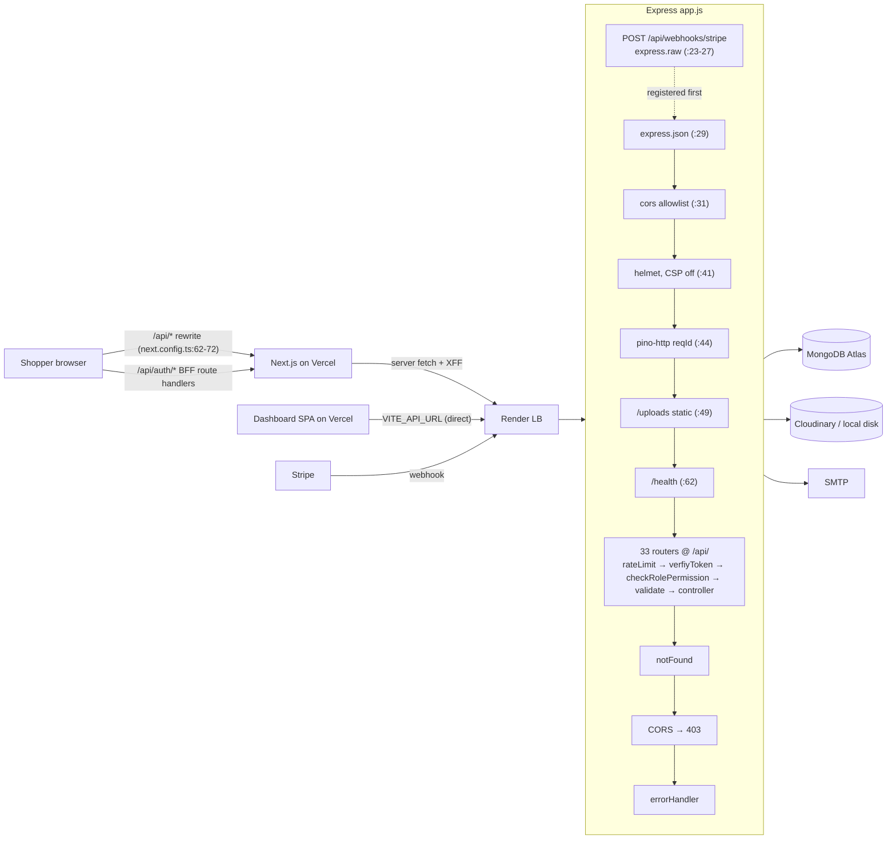
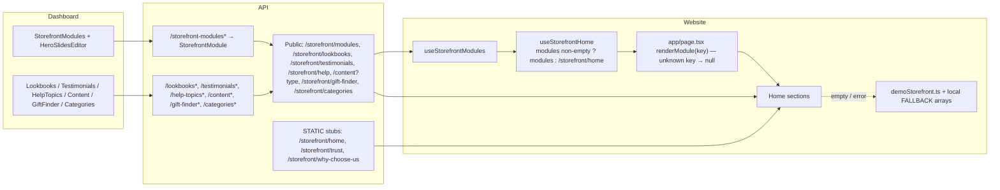
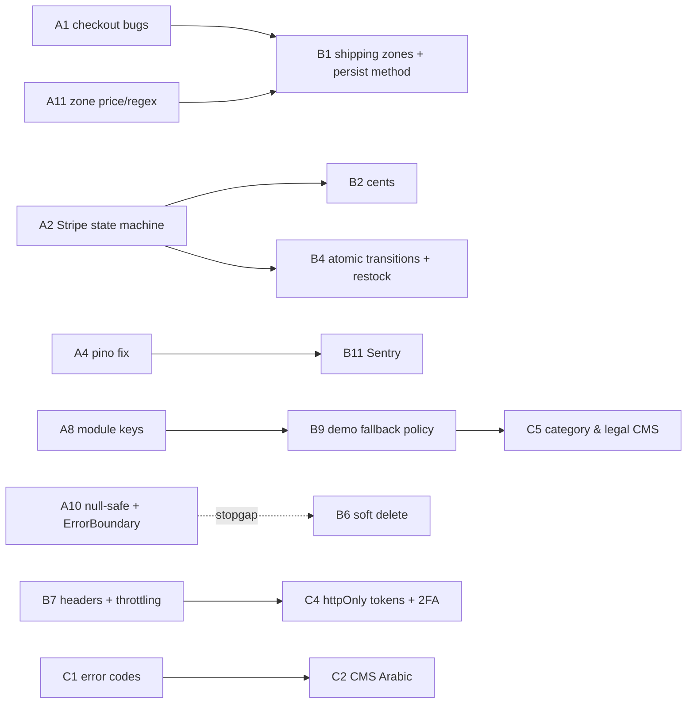

# TrendVaulta — Technical Audit Report

| | |
|---|---|
| **Date** | 2026-09-27 |
| **Scope** | Whole monorepo (`apps/api`, `apps/website`, `apps/dashboard`, CI, deploy config, docs), **working tree** on `main` @ `6b79def` including uncommitted changes (storefront modules / hero slides `translations.ar`, dashboard `HeroSlidesEditor`) |
| **Method** | Static, read-only reading of the code. The work was split into 7 parallel slices: API security, API commerce, API CMS, storefront contract, storefront i18n/a11y/state, dashboard, and delivery/ops. The results were then merged and de-duplicated, and the high-severity items were spot-checked a second time. The prompt is in [AUDIT_PROMPT.md](AUDIT_PROMPT.md). |
| **Not done** | Nothing was run: no lint, typecheck, tests, build, `npm audit`, or live app/Stripe checks. Every finding comes from reading the code. See [Open questions](#8-open-questions). |
| **Remediation status** | Updated 2026-09-29 — see [§0](#0-remediation-status-updated-2026-09-29) |
| **Companion files** | [API_MATRIX.md](API_MATRIX.md) (158 endpoint rows), [FRONTEND_MAP.md](FRONTEND_MAP.md) (every page in both apps) |

---

## 0. Remediation status (updated 2026-09-29)

Phases **A** (fix now) and **B** (next sprint) of the [roadmap](#7-remediation-roadmap) have been worked through. Every Critical and High finding is fixed. Each fixed or partly fixed finding carries a **Status** line (Critical/High/Medium) or a ✅ / 🟡 marker on its title (Low/Info) in [§5](#5-findings). Unmarked findings are still open.

| Severity | Total | ✅ Fixed | 🟡 Partly fixed | ⬜ Open |
|---|---|---|---|---|
| Critical | 2 | 2 | 0 | 0 |
| High | 13 | 13 | 0 | 0 |
| Medium | 66 | 37 | 8 | 21 |
| Low | 83 | 10 | 7 | 66 |
| Info | 12 | 0 | 0 | 12 |
| **Total** | **176** | **62** | **15** | **99** |

### Validation (2026-09-29)

All three apps were checked after the Phase A/B changes:

| Check | Result |
|---|---|
| API tests (`node --test`, real in-memory MongoDB) | 227 passed, 0 failed, 0 skipped |
| Website `tsc --noEmit` / lint | pass / 0 errors (28 older warnings, none new) |
| Website vitest | 54 passed |
| Dashboard `tsc --noEmit` / lint (`--max-warnings 0`) / jest | pass / pass / 31 passed |

Regression tests for this work: `apps/api/tests/hardening.test.js`, new cases in `apps/api/utils/commerce.test.js` and `refreshTokens.test.js`, `apps/website/src/lib/safeRedirect.test.ts`, and `apps/dashboard/src/lib/errorMessage.test.ts`. Not run: the website production build (needed to check the new CSP) and a live Stripe test-mode run.

### Decisions taken during remediation

| Topic | Decision |
|---|---|
| Delivery unticked at checkout (Q2 / API-203) | **Store pickup**: $0 shipping, stored as `shippingMethod: 'none'`, shown as "do not ship" in the dashboard |
| Per-customer coupon limits (API-204) | Configurable `perCustomerLimit` (paid orders count) |
| Restocking (API-205) | Only unshipped orders restock on refund/cancel; returned lines restock when a return is marked received |
| Deleting products/brands (API-212) | Always deactivate (soft delete) |
| Deleting users (OPS-725) | Anonymise (PII erased, orders and reviews kept) |
| Homepage sections without live data (WEB-406) | Hidden in production; demo content only under `next dev` |
| Bundle savings (API-210, Q6) | Savings not shown; bundle pricing at checkout deferred |
| Money storage (API-207) | Cent rounding at every step, still stored as dollars (no data migration) |

### Waiting on you

- **Stripe dashboard:** subscribe `checkout.session.async_payment_succeeded` and `checkout.session.async_payment_failed` (PAY-202).
- **Q1, proxy hops Vercel → Render:** needed to fix `trust proxy` and the per-IP limits (SEC-108, OPS-710).
- **Sentry:** approve the new dependencies and provide DSNs (OPS-702, B11).
- **Render:** confirm `autoDeployTrigger: checksPass` and `npm ci` on the next deploy; decide on the free plan (OPS-703, OPS-710).
- **Lockfile:** run `npm install --package-lock-only` once to refresh the `engines` metadata (OPS-708).
- **`eslint-plugin-jsx-a11y`** (dashboard/storefront), if you want placeholder-only fields caught automatically (DASH-618).

### Addressed findings by roadmap step

| Step | Findings |
|---|---|
| A1 | API-201 ✅, API-202 ✅ |
| A2 | PAY-201 ✅, PAY-202 ✅, PAY-203 ✅, PAY-204 ✅ |
| A3 | SEC-101 ✅, SEC-105 ✅ |
| A4 | OPS-701 ✅ |
| A5 | DASH-627 ✅, WEB-522 ✅ |
| A6 | OPS-712 🟡, SEC-104 ✅, SEC-106 ✅ |
| A7 | API-302 ✅, API-303 ✅, API-310 ✅, API-313 ✅ |
| A8 | API-301 ✅ |
| A9 | API-213 🟡, DASH-602 ✅, PAY-205 ✅ |
| A10 | DASH-603 ✅, DASH-620 ✅ |
| A11 | API-208 🟡, API-209 ✅ |
| A12 | WEB-509 ✅ |
| B1 | API-203 ✅, DASH-609 🟡, DASH-621 🟡 |
| B2 | API-207 ✅ |
| B3 | API-204 ✅, API-215 ✅ |
| B4 | API-205 ✅, API-206 ✅, API-225 ✅ |
| B5 | DASH-605 ✅, DASH-606 ✅, SEC-102 ✅, SEC-110 ✅ |
| B6 | API-212 ✅, OPS-725 ✅, SEC-111 🟡, SEC-113 ✅ |
| B7 | SEC-108 🟡, SEC-109 🟡, SEC-112 🟡 |
| B8 | API-102 ✅, SEC-107 ✅, WEB-501 🟡 |
| B9 | API-312 ✅, WEB-406 ✅ |
| B10 | API-210 ✅ |
| B11 | OPS-702 🟡, OPS-713 ✅ |
| B12 | OPS-703 ✅, OPS-708 ✅, OPS-710 🟡 |
| B12/B13 | OPS-722 🟡 |
| B13 | API-304 ✅, API-325 ✅ |
| B14 | API-316 🟡, WEB-409 ✅, WEB-410 ✅, WEB-414 ✅ |
| B15 | API-226 ✅, DASH-613 ✅, DASH-617 ✅, DASH-618 🟡 |
| B16 | WEB-508 ✅, WEB-510 ✅, WEB-511 ✅, WEB-512 ✅, WEB-513 ✅, WEB-514 ✅, WEB-515 ✅, WEB-518 ✅ |

Phase C (C1–C8) and every finding not listed above are still open.

---

## 1. Executive summary

TrendVaulta has a **solid foundation**:

- Server-side pricing.
- Per-flag idempotent paid side effects and Stripe webhook dedupe.
- Refresh-token rotation with reuse detection.
- A permission check on every admin route.
- Escaped search input.
- Upload magic-byte checks.
- Exact en/ar message-key parity and largely logical (RTL-safe) Tailwind.

The weak points are the **seams between the three apps**:

- **Checkout** breaks on two ordinary paths: a cart with two variants of the same product, and ticking "delivery" when no shipping zone exists. No shipping zone can be created from the UI.
- **Stripe payment states.** Some payment states can mark an order paid without running its side effects.
- **CMS.** Its content model and the storefront disagree on keys and on `active` flags, so publishing content can blank or corrupt the homepage.
- **Observability.** Production error logs lose their context, and there is no error tracking.

### Findings by severity (after de-duplication)

| Area | Critical | High | Medium | Low | Info | Total |
|---|---|---|---|---|---|---|
| Security & API foundation (SEC, API-1xx) | 0 | 2 | 9 | 8 | 2 | 21 |
| Commerce & payments (API-2xx, PAY-2xx) | 2 | 3 | 14 | 16 | 3 | 38 |
| CMS & user content (API-3xx) | 0 | 3 | 12 | 14 | 1 | 30 |
| Storefront (WEB) | 0 | 2 | 15 | 20 | 3 | 40 |
| Dashboard (DASH) | 0 | 2 | 9 | 11 | 2 | 24 |
| Delivery, ops, docs (OPS) | 0 | 1 | 7 | 14 | 1 | 23 |
| **Total** | **2** | **13** | **66** | **83** | **12** | **176** |

About 30 cross-slice duplicates were merged. The surviving IDs keep their original numbers, so gaps in numbering are expected. The alias list is at the top of [§5](#5-findings).

### Top 10 risks

| # | ID | Risk | Severity | Status |
|---|---|---|---|---|
| 1 | API-201 | Checkout fails with 400 "One or more products not found" whenever the cart has **two variants of the same product** (e.g. size M and size L). | Critical | ✅ Fixed (A1) |
| 2 | API-202 | Ticking "delivery" at checkout sends `shippingMethod: ''`, which Joi rejects. No ShippingZone is seeded and the dashboard has **no shipping-zone UI** (DASH-609), so in practice the whole delivery path fails. | Critical | ✅ Fixed (A1) |
| 3 | PAY-201 / PAY-202 / PAY-203 | Stripe state-machine holes: `payment_intent.succeeded` marks orders paid **without side effects or cancel checks**; `checkout.session.completed` ignores `payment_status` (async methods); the webhook and verify-payment race can erase a `needs_attention` oversell flag. | High | ✅ Fixed (A2) |
| 4 | SEC-101 | **Moderators can change tax and shipping rates** through `PUT /api/admin/settings` (`content:write`), which re-prices every order. | High | ✅ Fixed (A3) |
| 5 | API-203 | The shipping charge is decided by the client's `delivery`/`shippingMethod` flags (default: $0), and the chosen method is **never stored on the order**, so fulfilment can't see it. | High | ✅ Fixed (B1) |
| 6 | API-301 / API-302 / API-303 | CMS ↔ storefront contract is broken: seeded or created modules **hide 6 homepage sections**; "deleted" testimonials and lookbooks **stay live**; creating a Content draft **unpublishes** the live Shipping/Returns page. | High | ✅ Fixed (A7, A8) |
| 7 | OPS-701 | Every production 500 logs only `"Request failed"`: pino's argument order drops the error object. There is **no Sentry/APM** either (OPS-702). | High | ✅ Fixed (A4) |
| 8 | WEB-522 | Storefront logout keeps the previous user's orders, addresses and wishlist in the React Query cache, so they leak on shared devices. | High | ✅ Fixed (A5) |
| 9 | SEC-105 | The dashboard "Change password" form calls the admin `PUT /users/:id`. It **skips the current-password check**, always returns 403 for moderators, and silently logs the admin out. | High | ✅ Fixed (A3) |
| 10 | DASH-603 / API-212 | Products and brands are **hard-deleted** without a cascade: `/bundles` and `/product-qa` in the dashboard white-screen (there is no error boundary, DASH-620), and references are orphaned. | High | ✅ Fixed (A10, B6) |

### Health score per area (0–5)

| Area | Score | Justification |
|---|---|---|
| API security | **3.5** | Permissions on every admin route, rotation with reuse detection, escaped regex, and upload checks are good. Held back by one privilege gap (SEC-101), JS-readable tokens, weak brute-force limits, and an open-redirect edge case. |
| Commerce & payments | **2** | Server-side pricing and idempotency leases are good, but two checkout-breaking bugs, Stripe state holes, float money, and client-chosen shipping remain. |
| CMS / content | **2** | Many models and admin screens exist, but the storefront ignores or misreads much of the content (keys, `active`, trust, privacy/terms, categories), and there is no Arabic outside hero slides. |
| Storefront (Next.js) | **3** | Good BFF for the refresh token, sanitised CMS HTML, and correct locale resolution. Most pages are client-only (weak SEO), with hydration mismatches, cache leaks on logout, and demo data masking outages. |
| Dashboard | **2.5** | Consistent hooks and query invalidation, and an accessible confirm dialog. Several features are broken (tracking, password, modules), there is no error boundary, and a11y has never been addressed. |
| i18n / RTL | **3.5** | UI keys have 100% parity, RTL uses logical classes, and money uses Intl. CMS content, API errors, page titles and emails are English only. |
| Accessibility | **2.5** | Storefront forms are good. The review rating, focus traps, skip link and reduced motion are missing. All 15 dashboard modals are inaccessible. |
| Testing & CI | **3** | Strong API integration tests for payments and orders. There are no tests for auth, the refresh interceptor, returns, permissions wiring or e2e, and deploys are not gated on CI. |
| Ops / observability | **2** | Graceful shutdown, a readiness endpoint and request IDs exist. Error logs are broken, there is no error tracking, the Render plan is free, the rate limiter is in-memory, and admin bootstrap is destructive. |
| Docs | **2** | Rich docs, but they drift in many places: AGENTS.md, READMEs and PROJECT_REFERENCE.md contradict the code, and key docs are untracked in git. |

---

## 2. Inventory (Phase 0)

### 2.1 Workspaces & tooling

| Workspace | Scripts | Key dependencies (resolved in `package-lock.json`) | Notes |
|---|---|---|---|
| root | `dev`, `dev:*`, `build`, `build:website`, `build:dashboard`, `build:types`, `lint`, `test`, `test:api`, `typecheck:website`, `typecheck:dashboard`, `clean` | concurrently 8.2.2 | engines `node >=20.9.0` (real floor is ≥22.12, see OPS-708); `.nvmrc` = 22; **no** `typecheck:types` script and **no** `pnpm-workspace.yaml` (AGENTS.md is stale, OPS-721) |
| `apps/api` | `start`, `dev` (nodemon), `build` (no-op), `test` (`node --test`) | express 5.2.1, mongoose 8.24.1, jsonwebtoken 9.0.3, joi 18.2.3, stripe 17.7.0, multer 2.4.0, nodemailer 8.0.11, helmet 8.3.0, bcryptjs 3.0.3, pino 9.14.0 | **No lint script**; `main: index.js` does not exist |
| `apps/website` | `dev -p 3001`, `build`, `start`, `lint`, `test` (vitest) | next 16.3.6, react 19.2.3, @tanstack/react-query 5.101.2, axios 1.18.1, zod 4.4.3, js-cookie 3.0.8, tailwind 4.3.2 | `zustand` and `next-intl` are **unused** (the cart is a `useSyncExternalStore` store); vitest 2.1.9 with plugin-react 6 is a peer mismatch (OPS-717) |
| `apps/dashboard` | `dev`, `build` (`tsc && vite build`), `lint`, `preview`, `test` (jest) | react 19.2.7, react-router-dom 6.30.4, vite 5.4.21, eslint 8.57 (EOL), tailwind 3.4, recharts 2.15 | 10 unused dependencies (OPS-719 / DASH-634) |
| `packages/types` | `build`, `dev` | — | Tracked and in workspaces, but **nothing imports it** (AGENTS.md says it was removed) |

No resolved version matched a known CVE in a manual read (**Suspected-clean**). Run `npm audit` to confirm (see §8).

### 2.2 Environment variables

Full table: see the OPS slice in §5.6 and the drift findings OPS-706, OPS-707, WEB-421. Summary:

- **API.** 50+ vars. `.env.example` covers all of them except `TEST_REAL_REQUEST_LOGGER` (test only). `render.yaml` omits `TAX_RATE_PERCENT`, `RETURN_WINDOW_DAYS`, `UPLOAD_PUBLIC_BASE_URL`, `CLOUDINARY_FOLDER`, `LOG_*`, `SEED_ADMIN_*`, and the contact/newsletter rate limits, so code defaults apply. `LOG_FILE`/`LOG_DIR` are dead.
- **Website.**
  - `NEXT_PUBLIC_API_URL` must be given **without** `/api` according to `.env.example`, but CI sets it **with** `/api`.
  - `FRONTEND_URL` is used but undocumented.
  - `NEXT_PUBLIC_SITE_URL` silently falls back to localhost.
- **Dashboard.** Only `VITE_API_URL`, which must include `/api`. If it is unset, requests hit the SPA rewrite and get `index.html` back. `.env.example` is **untracked**.
- **Secrets.** No live secrets in tracked files. Only placeholder `.env.example` files are committed.

### 2.3 Data model (24 Mongoose models)

| Model | Key fields | Indexes | Refs / hooks / notes |
|---|---|---|---|
| User | email, username (not unique), password (bcrypt 10), roles[], disabled, addresses[], adminNotes, stripeCustomerId | email unique | `generateAuthToken` → HS256 `{id, roles}` 15 min (`User.js:131-139`) |
| RefreshToken | tokenHash (SHA-256), user, expiresAt 30 d, revokedAt | tokenHash | rotation + reuse detection in `utils/refreshTokens.js` |
| StoreSettings | taxRatePercent, shipping.*RateUsd, freeShippingThresholdUsd, currency, contactEmail | — | 30 s in-process cache (`commerce.js:16-40`); `currency` is unused (API-107) |
| Product | title, price, basePrice, stock, variants[{size,color,stock,price,sku}], brand, category enum, isActive, salesCount, averageRating, reviewCount | text(title, description, subcategory); {isActive,category,price}; {isActive,brand}; {isActive,createdAt}; sku unique sparse | ref Brand; no hooks keep stock equal to the sum of variant stock |
| Brand | name, slug (unique), isActive, featured | {featured,isActive} | hard delete |
| Category | slug, name, parent, sortOrder, isActive | {parent,slug} unique | lazy self-seed per request (API-329) |
| Order | items[], itemsPrice, shippingPrice, taxPrice, discountAmount, totalPrice (float), status, paymentStatus, side-effect flags, refund*, tracking*, returnRequest | {user,createdAt}; {status,createdAt}; {paymentStatus,createdAt}; stripeSessionId / paymentIntentId sparse (ineffective: default `''`) | **no `delivery`/`shippingMethod` field** (API-203) |
| Coupon | code (unique, upper), discountType, discountValue, usageLimit, usedCount, minimumOrderAmount, expirationDate, isActive | code unique | no per-user usage |
| Offer | title, href, imageUrl, endsAt, active, sortOrder | active; sortOrder | banner only, no pricing effect |
| ShippingZone | countries[], regionPattern / postalCodePattern (regex strings), methods[] | {isActive,sortOrder}; countries | **no admin UI** |
| Bundle | primaryProduct (unique), items[], bundlePrice, savings, active | {primaryProduct,active} | savings never applied (API-210) |
| StripeWebhookEvent | eventId (unique), type, status | TTL 90 d | stuck `processing` never reclaimed (PAY-204) |
| Review | user, product, rating, comment, verifiedPurchase, reply | {user,product} unique | no `{product,createdAt}` index; no moderation status |
| Wishlist | user, product | {user,product} unique; user; product | — |
| ProductQA | product, question (no max), answer, helpful, notHelpful, approved | {product,approved}; approved | no voter record |
| RecentlyViewed | user (unique), items ≤12 | user unique | read-modify-write race |
| StorefrontModule | key, type (enum), active, sortOrder, config, slides[] (+ `translations.ar`), trustItems[], limit, items | {key,active} partial unique | the **only** model with Arabic fields |
| Testimonial / Lookbook / HelpTopic | id (slug, unique), text fields, active, sortOrder | id; active; sortOrder | public endpoints ignore `active` (API-302) |
| Content | type (enum, 5 values), title, body (HTML), active | {type,active} partial unique | create deactivates others first (API-303) |
| GiftFinderConfig | occasions / recipients / budgets[] | {active} (not unique) | "singleton" not enforced |
| Subscriber | email (unique), source, status | email | no consent token |
| ContactMessage | name, email, subject, message, status, ip | createdAt | status never updated; no admin UI |

### 2.4 API surface and frontends

- **API:** 158 endpoint rows across 33 routers, all mounted at `/api/` (plus the webhook, `/health`, `/uploads`). See [API_MATRIX.md](API_MATRIX.md).
- **Storefront:** 35 `page.tsx` routes plus 4 BFF route handlers, `sitemap`, `robots`, and the not-found/error/loading boundaries. **Dashboard:** 22 page routes in `src/App.tsx`. See [FRONTEND_MAP.md](FRONTEND_MAP.md).

---

## 3. Architecture (Phase 1)

### 3.1 System and request lifecycle



- **Middleware ordering is correct.** The Stripe raw body is registered before `express.json`. `trust proxy` is set to 1, which may be the wrong hop count behind Vercel (SEC-108).
- **Middleware is attached per route**, with no router-level `use`. Every admin route has `checkRolePermission`, but that check uses exact `includes`, so wildcard permissions such as `content:*` do nothing.
- **Validation is inconsistent.** Some routes use `validate(schema)` (body only, `stripUnknown`), others use inline Joi in controllers, and others use hand-written parsing.

### 3.2 Auth / session lifecycle

```mermaid
sequenceDiagram
  participant Br as Storefront browser
  participant NX as Next /api/auth/* (BFF)
  participant API as Express API
  participant DB as Mongo
  participant DA as Dashboard SPA
  Br->>NX: POST /api/auth/login
  NX->>API: POST /api/auth/login
  API->>DB: bcrypt.compare, disabled?, RefreshToken.create(hash, 30d)
  API-->>NX: {token (JWT 15m), refreshToken, roles}
  NX-->>Br: Set-Cookie tv_refresh (httpOnly, path /api/auth); JSON without refreshToken
  Br->>Br: js-cookie: token + userRole (7d, JS-readable)
  Br->>API: /api/* Bearer token (via rewrite)
  API-->>Br: 401 after 15m
  Br->>NX: POST /api/auth/refresh (single-flight per tab)
  NX->>API: {refreshToken}
  API->>DB: findOne(hash): revoked? → revoke ALL (reuse) : rotate
  API-->>NX: new pair → cookie rotated
  Br->>NX: POST /api/auth/logout → API revokes → cookie cleared
  Note over Br: React Query caches NOT cleared (WEB-522)
  DA->>API: POST /api/auth/login (direct)
  DA->>DA: token, role AND refreshToken in JS cookies (SEC-103)
  DA->>API: 401 → POST /auth/refresh; any failure → logout (DASH-606)
  Note over API: password change/reset, admin disable → revokeAllForUser (incl. own session: SEC-110). Role change does NOT revoke (SEC-111).
```

### 3.3 Checkout → paid lifecycle

```mermaid
sequenceDiagram
  autonumber
  participant C as Cart / Checkout (website)
  participant API as API
  participant DB as Mongo
  participant S as Stripe
  C->>API: POST /payments/quote {items, couponCode, delivery, shippingMethod}
  API-->>C: server lines + totals (client falls back to its own $5/$0 guess on error)
  C->>API: GET /shipping/methods (zones; none seeded → shippingMethod '' → 400, API-202)
  C->>API: POST /payments/checkout-session
  API->>DB: buildNormalizedOrderLines (fails on 2 variants of same product, API-201)
  API->>DB: Order.create(pending) — no stock reservation
  API->>S: coupons.create (temp) + checkout.sessions.create(expires +30m)
  API-->>C: {url} → Stripe Checkout
  par Webhook
    S->>API: checkout.session.completed (payment_status not checked, PAY-202)
    API->>DB: StripeWebhookEvent claim → markOrderPaidFromSession
    API->>DB: leases: stockDecremented / couponIncremented / salesCountIncremented
    API->>API: confirmation email (no lease, PAY-205)
  and Success page poll
    C->>API: POST /payments/verify-payment (2s…3min)
    API->>S: sessions.retrieve → same markOrderPaidFromSession (race, PAY-203)
  end
  Note over API,S: payment_intent.succeeded → sets paid with NO side effects/state checks (PAY-201)
  Note over API,S: charge.refunded (full) → refunded + restock ALL lines, even delivered (API-205)
```

What works well:

- Client prices and totals are stripped (`models/Order.js:379-381`).
- Side-effect leases are conditional updates.
- The webhook is deduplicated by `eventId`.
- Cancel uses a conditional claim.

### 3.4 CMS → storefront content flow



Gaps:

- The layout is chosen by free-text `key` (API-301). The storefront never reads module `type`, `title`, `limit`, `config` or `trustItems` (WEB-405).
- Trust and "Why choose us" always come from static API constants.
- PRIVACY, TERMS and STOREFRONT_TRUST content is editable but never rendered.
- `/c/*` pages ignore the Category CMS (API-315).
- Only hero slides carry Arabic (API-311).
- Demo content masks both empty CMS data and API failures (WEB-406, API-312).

### 3.5 Assessment

| Concern | Assessment |
|---|---|
| **Layering** | API is route → middleware → controller → model, with `utils/commerce.js` as a good pricing/stock core. Controllers are large (payment.controller.js ~720 lines), and invoice HTML and mail transports live inside controllers. |
| **Duplication across apps** | Each app has its own types and API client (intended per AGENTS.md). `packages/types` is dead. Permissions are hand-mirrored (`dashboard/src/lib/permissions.ts` vs `rolePermissions.js`) with no parity test, and `shipping:*` / `content:*` are missing (DASH-621). |
| **Response shapes** | At least 5 shapes: bare doc/array, `{data, meta}`, `{message, results}`, `{message, data}`, and module/topic keys. Errors come as `{message}` or `{success, message, code, details}` (API-228). `pages` can be 0 or 1 when empty. |
| **Pagination naming** | `page`/`limit` in, `meta{total, page, pages, limit}` out on products and brands. Other lists differ; `/orders/my` is unbounded. |
| **Error handling** | The central `errorHandler` hides 5xx messages in production (good), but its logs lose context (OPS-701). Controllers use `console.*`. Raw body-parser and Stripe messages leak (PAY-206). There are no error boundaries in the dashboard and no `global-error.tsx` in the website. |
| **Config** | `config/env.js` validates at boot, but only inside `start()`, and `dotenv` loads after the logger config (API-104). The `/api` suffix convention differs between apps (OPS-706). |
| **Logging** | pino with redaction and request IDs, but the argument order is wrong at the error sites, request IDs are not echoed in responses, and the webhook is logged before the request logger runs (OPS-713). |

---

## 4. Phase 2 & 3 highlights

### 4.1 Frontend ↔ backend contract

| Topic | Result |
|---|---|
| **Storefront client** (`apps/website/src/lib/api.ts`) | Every method's path, method and response shape matches its controller (per-method table in the WEB slice, summarised in FRONTEND_MAP). Type drift: `OrderCheckoutPayload.shippingAddress` has no `country`; `shippingMethod` is typed as 3 literals but zone handles and `''` are sent (API-202); `CartQuoteResponse.couponMessage` is typed `string` but the API returns `null`; in `getMyReviews`, `product` is populated but typed `string`. |
| **Dashboard client** (`apps/dashboard/src/lib/api.ts`) | Paths all match. Create/update for modules, lookbooks, testimonials, bundles, gift finder, Q&A answer and order tracking are typed as the entity, but the API returns `{message, data}`. This is latent because the return values are unused (DASH-630). `limit: 100` for brands is clamped to 50 (API-223). |
| **Fields dropped by `stripUnknown`** | Testimonial/lookbook `id` on update (API-322). No other frontend-sent field was found to be silently dropped. |
| **Dead client methods** | Website: `getCouponByCode`, `getMyReview`, `newsletter.unsubscribe`, the `useUpdateProfile` stub, and `endpoints.orders.list/updateStatus`, `endpoints.shipping.zones`. Dashboard: 6 `get*ById` methods. See WEB-419, DASH-630. |
| **Endpoints with no UI** | 8 × `/admin/shipping/zones*` (DASH-609), `/contact/admin`, `/newsletter/admin`, `/orders/:id/invoice`, `GET /orders/:id/return`, `/coupons/:id/use`, and admin `GET /:id` lookups. |
| **UI with no real data** | Trust strip and "Why choose us" (static API stubs); privacy and terms (hard-coded); cart trust items (always demo); FBT "demo save" (WEB-407); the order tracking timeline component is a demo while real `trackingEvents` are never rendered (WEB-420). |
| **Demo fallback masking failures** | Homepage hero and layout, testimonials (invented quotes), featured brands (invented brands), deals, categories, lookbooks, gift finder (swallows errors) and trust. See WEB-406, API-312. No demo **product** or price reaches the cart. |
| **Permissions parity** | The 12 moderator and 23 admin permissions are identical. The dashboard is missing admin `content:*` (no effect), `shipping:read` and `shipping:write` (DASH-621). UI and API disagree on store settings (SEC-101), tracking (DASH-602) and the password form (SEC-105). The dashboard derives permissions from a JS `role` cookie and ignores the `permissions` returned by `/auth/profile`. |

### 4.2 What is already good (do not regress)

- **Stripe webhook and pricing**
  - Stripe raw-body ordering is correct (`app.js:23-29`).
  - Webhook events are deduped by `eventId`.
  - Paid side effects use per-flag conditional leases, which are tested (`tests/payments.test.js`).
  - Client prices, shipping and tax are stripped; totals are always server-side (`models/Order.js:379-403`).
- **Access control and input handling**
  - Every staff route has `checkRolePermission`. Register forces `roles: ['user']`, and profile/user updates whitelist fields (no mass assignment found).
  - Search input is regex-escaped (`utils/search.js:5`). No NoSQL operator injection was found (Joi or `typeof` checks everywhere).
- **Auth, CORS and errors**
  - Refresh tokens are hashed, rotated, reuse-detected and revoked on password change or disable. Reset tokens are single-use (the secret includes the password hash).
  - CORS fails closed in production, and `CORS_RELAXED` is refused in production.
  - 5xx messages are scrubbed in production.
- **Uploads:** 5 MB limit, MIME allowlist, magic-byte check, uuid filenames, `index:false`.
- **Storefront**
  - The refresh token is httpOnly through a Next BFF.
  - CMS HTML is sanitised (`lib/sanitizeHtml.ts`).
  - en/ar keys match exactly (1274/1274), and RTL uses logical classes (only 32 physical classes, 30 of them decorative gradients).
  - Prices go through `Intl.NumberFormat`.

---

## 5. Findings

Findings are grouped by area and sorted by severity. Critical, High and Medium findings use the full schema. Low and Info findings use a compact table with the same fields.

**Merged duplicates (alias → canonical):**

| Aliases | Canonical ID |
|---|---|
| API-101 | OPS-701  |
| API-103 | OPS-712  |
| API-105, API-324 | API-228 |
| API-106 | OPS-718  |
| DASH-601, WEB-401 | API-301 |
| DASH-604 | SEC-105  |
| DASH-606 (race part) | SEC-102 |
| DASH-607 | SEC-103  |
| DASH-608 | SEC-101 (settings part) and DASH-602 (tracking part)  |
| DASH-610 | API-322  |
| DASH-611, WEB-403 | API-310 |
| DASH-614 | API-223  |
| DASH-616 | SEC-113  |
| DASH-619, WEB-502 | API-311 |
| DASH-623 | API-323  |
| DASH-625 | API-227 / API-215  |
| OPS-704, WEB-408 | PAY-205 |
| OPS-705 | API-304  |
| OPS-711 | API-214  |
| WEB-402 | API-302  |
| WEB-404 | SEC-108  |
| WEB-407 | API-210  |
| WEB-411 | SEC-109  |
| WEB-417, WEB-525 | API-312 |
| WEB-503 | WEB-413  |
| WEB-504 | WEB-422  |
| WEB-523, WEB-524 | WEB-410 |
| WEB-533 | WEB-416  |

### 5.1 Security & API foundation

#### SEC-101 · Moderators can change checkout pricing (tax and shipping) through store settings
**High · Confirmed · Effort S**
- **Status (2026-09-29):** ✅ Fixed in A3. New admin-only `settings:write`; dashboard gates on it; tested (moderator 403).
- **Location:** `apps/api/routes/settings.js:15-20`, `apps/api/middlewares/rolePermissions.js:17`, `apps/api/controllers/settings.controller.js:28-49`, `apps/api/utils/commerce.js:141-172`, `apps/dashboard/src/pages/Settings.tsx:29,280`
- **Evidence:** `PUT /api/admin/settings` is gated by `content:write`, and moderators hold that permission. The endpoint writes `taxRatePercent`, `shipping.*RateUsd` and `freeShippingThresholdUsd`, which every quote and order uses. The dashboard shows the form only when `role === 'admin'`, so the UI is stricter than the API.
- **Impact:** A moderator, or a stolen moderator token, sends `PUT {taxRatePercent: 0, shipping: {standardRateUsd: 0, expressRateUsd: 0}}`. Every later order is under-charged.
- **Fix:** Add an admin-only `settings:write` permission (mirror it in `permissions.ts`) and keep `content:read` for GET.

#### SEC-105 · Dashboard password change skips the current-password check, is always 403 for moderators, and logs the admin out
**High · Confirmed · Effort S** (merged DASH-604)
- **Status (2026-09-29):** ✅ Fixed in A3. Dashboard uses `POST /password/change` with current password, then signs out cleanly.
- **Location:** `apps/dashboard/src/pages/Settings.tsx:118-151,139-140,402-405`, `apps/api/controllers/user.controller.js:109-129`, `apps/api/routes/users.js:48-53`, `apps/api/routes/password.js:25-30`
- **Evidence:** The form calls `adminUsersApi.updateUser(user._id, {password})`, which is `PUT /api/users/:id` (`users:write`). That route hashes the new password without verifying the old one, then runs `revokeAllForUser`, which includes the caller's own session. The existing `POST /api/password/change` verifies `currentPassword` and is rate-limited.
- **Impact:**
  - A hijacked admin access token (valid ≤15 min) can set a new password and lock the real admin out.
  - Moderators always get 403.
  - Admins are silently logged out at the next refresh.
- **Fix:** Use `POST /password/change` with a "current password" field, and have that endpoint keep or reissue the current session while revoking the others.

#### SEC-102 · Refresh-token rotation is not atomic and has no grace window; concurrent refreshes log users out everywhere
**Medium · Confirmed (code); multi-tab trigger Suspected · Effort M** (merged DASH-606 race part)
- **Status (2026-09-29):** ✅ Fixed in B5. Atomic rotation + 30 s grace window; unit-tested.
- **Location:** `apps/api/utils/refreshTokens.js:45-68`, `apps/website/src/lib/api.ts:106-133`, `apps/dashboard/src/lib/api.ts:46-75`
- **Evidence:** The code does `findOne` → check `revokedAt` → issue → `save`, with no conditional update. The single-flight `refreshPromise` is module-level, so it only covers one tab.
- **Impact:**
  - Two tabs hit a 401 together. The first rotates the token. The second presents the now-revoked token, which counts as reuse and triggers `revokeAllForUser`, logging the user out on every device.
  - Two truly simultaneous requests can both mint successors, which bypasses reuse detection.
- **Fix:** Rotate with `findOneAndUpdate({tokenHash, revokedAt: null}, {$set: {revokedAt: now}})`, add a ~30 s grace window that returns the successor, and optionally coordinate tabs with `navigator.locks` or `BroadcastChannel`.

#### SEC-103 · Dashboard keeps a 30-day admin refresh token in a JS-readable cookie
**Medium · Confirmed · Effort M–L** (merged DASH-607)
- **Location:** `apps/dashboard/src/lib/auth.ts:5,11,47-53,64-71,183-189,206-211`, `apps/dashboard/src/lib/api.ts:51-57`
- **Evidence:** The code calls `Cookies.set('refreshToken', …, {expires: 30, sameSite: 'lax'})` with no httpOnly flag. It is set even when "remember me" is off.
- **Impact:** Any XSS on the dashboard origin, or a malicious dependency, exfiltrates a 30-day admin credential.
- **Fix:** Mirror the storefront BFF pattern: the API or a same-origin function sets an httpOnly refresh cookie and the access token stays in memory. At minimum, honour `remember` and shorten the TTL for staff.

#### SEC-104 · Open redirect: `getSafeRedirectPath` lets a tab character through
**Medium · Confirmed (proxy path, per the WHATWG URL spec); Suspected for `router.push` · Effort S**
- **Status (2026-09-29):** ✅ Fixed in A6. Control chars/whitespace/backslash rejected + same-origin URL check; 12 vitest cases.
- **Location:** `apps/website/src/lib/safeRedirect.ts:125-132`, `apps/website/src/proxy.ts:34-37`, `apps/website/src/app/auth/login/page.tsx:52-55`, `apps/website/src/app/auth/signup/page.tsx:51-54`
- **Evidence:** The function rejects only `//`, `/\` and CR/LF. For `?redirect=/%09/evil.example`, the value is `"/\t/evil.example"`. `new URL(v, request.url)` strips the tab, which yields `//evil.example`.
- **Impact:** A signed-in user who opens `https://store/auth/login?redirect=/%09/evil.example` is redirected by `proxy.ts` to the attacker's site (phishing).
- **Fix:** Reject control characters and whitespace (`/[\u0000-\u001F\u007F\s\\]/`), or parse with `new URL(v, origin)`, require a same origin, and return `pathname + search + hash`.

#### SEC-106 · Forgot-password returns the reset link in the response when mail fails and `NODE_ENV` ≠ production; an unset `NODE_ENV` defaults to development
**Medium · Confirmed (code); exposure conditional · Effort S**
- **Status (2026-09-29):** ✅ Fixed in A6. Reset link never returned; logged only when NODE_ENV=development; generic 200 on mail failure.
- **Location:** `apps/api/controllers/password.controller.js:110-117`, `apps/api/config/env.js:26-31`
- **Evidence:** `if (NODE_ENV !== 'production') return {resetPasswordLink: link}`. `validateEnv` defaults `NODE_ENV` to `'development'` and only warns. `render.yaml` sets production, but a staging, preview or Docker deploy without it is exposed.
- **Impact:** If SMTP is broken, an attacker POSTs the victim's email and receives a working reset link, which is account takeover (including admins).
- **Fix:** Echo the link only behind an explicit `DEV_ECHO_RESET_LINK=true` that is refused in production, and fail boot when `NODE_ENV` is unset.

#### SEC-107 · Changing the profile email needs no password and no verification; email validation is `includes('@')`
**Medium · Confirmed · Effort M**
- **Status (2026-09-29):** ✅ Fixed in B8. Email change requires the current password (Joi email validation, lockout-counted); tested. No confirmation mail to the new address.
- **Location:** `apps/api/controllers/profile.controller.js:54-90` (validation at :63)
- **Evidence:** `PUT /api/auth/profile {email}` writes the new address directly. `"@@@@@"` passes validation.
- **Impact:** A stolen 15-minute token can change the email, then use forgot-password, which is a permanent takeover. A typo leaves the user unable to reset their password.
- **Fix:** Require `currentPassword` (or email verification) for email changes, validate with `Joi.string().email()`, and revoke other sessions.

#### SEC-108 · Weak brute-force protection: IP-only, in-memory, 30/min in production, no per-account lockout; behind Vercel `req.ip` is probably the Vercel egress
**Medium · Confirmed (limits); Suspected (IP collapse; would be High if confirmed) · Effort M** (merged WEB-404)
- **Status (2026-09-29):** 🟡 Partial in B7. Per-account lockout (5 wrong → 15 min, stored in DB; also on email change); tested. Still open: `trust proxy` hop count (open question Q1), shared rate-limit store.
- **Location:** `apps/api/middlewares/rateLimit.js:22-28,42,111-116,125-130,159-164`, `apps/api/render.yaml:38-43`, `apps/api/app.js:21`, `apps/website/src/lib/serverAuth.ts:85-93`, `apps/website/next.config.ts:62-72`, `apps/api/routes/payments.js:22-27`
- **Evidence:**
  - `RATE_LIMIT_AUTH_MAX=30` per minute in `render.yaml`, against a code default of 5. Buckets live in a process-local `Map` that resets on every deploy.
  - With `trust proxy` = 1, `req.ip` is the right-most XFF hop. All storefront traffic goes through Vercel (BFF or rewrite).
  - The checkout limiter runs before `verfiyToken`, so its user key is always `anonymous`.
- **Impact:**
  - Credential stuffing across many IPs has no per-account ceiling.
  - If the IP does collapse to Vercel's, a single attacker, or ordinary peak traffic, exhausts the shared login, refresh and checkout buckets. The result is 429s and forced logouts for everyone.
- **Fix:**
  - Add a per-account failure counter with backoff and move buckets to a shared store.
  - Set `trust proxy` to the true hop count or a trusted CIDR, or have the BFF send a signed client-IP header.
  - Run the checkout limiter after auth.

#### SEC-109 · Storefront access token is JS-readable, and the Next app sends no security headers (CSP, frame-ancestors, HSTS)
**Medium · Confirmed (acknowledged follow-up in AGENTS.md) · Effort M** (merged WEB-411)
- **Status (2026-09-29):** 🟡 Partial in B7. Storefront CSP (no nonces), frame, nosniff, referrer, permissions and HSTS headers. Still open: nonce-based script-src, httpOnly access token (C4).
- **Location:** `apps/website/src/lib/authCookies.ts:11-24,43-45`, `apps/website/next.config.ts` (no `headers()`), `apps/website/vercel.json`
- **Evidence:** The `token` cookie is not httpOnly and lasts 7 days. There is no CSP, X-Frame-Options, Referrer-Policy or Permissions-Policy.
- **Impact:** Any XSS yields a live bearer token (escalates through SEC-107). The site can be framed for clickjacking.
- **Fix:** Add `headers()` with a CSP (nonce or strict-dynamic), `frame-ancestors 'none'`, HSTS, `Referrer-Policy` and `nosniff`, then move the access token behind the BFF as planned.

#### SEC-110 · Changing the password on the storefront revokes the caller's own refresh token (forced logout within 15 min)
**Medium · Confirmed · Effort S**
- **Status (2026-09-29):** ✅ Fixed in B5. Storefront signs out with a clear "sign in again" message after a password change.
- **Location:** `apps/api/controllers/password.controller.js:216-218`, `apps/website/src/app/user/security/page.tsx:55-62`, `apps/website/src/lib/api.ts:147-161`
- **Evidence:** `revokeAllForUser` runs after the change. The UI shows success and keeps the session. The next refresh returns 401, and the user sees a "Please sign in" toast.
- **Impact:** Users experience an unexplained logout right after a successful change.
- **Fix:** Return a fresh pair for the current session and revoke only the others, or log out explicitly with a clear message.

#### SEC-113 · Admins can remove their own admin role or delete themselves; no last-admin guard
**Medium · Confirmed · Effort S** (merged DASH-616)
- **Status (2026-09-29):** ✅ Fixed in B6. No self-demote/self-delete; last-enabled-admin guard; tested.
- **Location:** `apps/api/controllers/user.controller.js:96-104,139-150`, `apps/dashboard/src/pages/Users.tsx:94-150,319-355`
- **Evidence:** Only self-disable is blocked. The UI does not know who the current user is.
- **Impact:** The only admin can lock the store out of the dashboard. Recovery then needs the destructive seeder (API-304) or direct DB access.
- **Fix:** Block self role-removal, self-delete, and any change that leaves zero admins. Hide those actions for the current user.

| ID | Title | Sev | Status | Location | Evidence / Impact | Fix | Effort |
|---|---|---|---|---|---|---|---|
| SEC-111 | 🟡 Access JWT can't be revoked; role demotion or delete doesn't revoke sessions | Low | Confirmed | `middlewares/verfiyToken.js:13-15`, `models/User.js:127-139`, `controllers/user.controller.js:96,127-129` | `verfiyToken` trusts `roles` from the JWT and revocation runs only on password or `disabled` changes. A demoted or deleted rogue admin keeps access for ≤15 min. | Revoke on role change or delete; add a `tokenVersion` claim checked on staff routes. | S–M |
| SEC-112 | 🟡 User enumeration through register, login timing and forgot-password | Low | Confirmed | `controllers/auth.controller.js:47-50,91-94`, `controllers/profile.controller.js:77-80`, `controllers/password.controller.js:58-60,107-122` | "This user already registered". Login skips bcrypt for unknown emails. A reset mail failure returns 500 only for real accounts. | Return generic responses, run a dummy bcrypt compare, and send mail asynchronously. | S |
| SEC-114 | `users:read` (moderators) returns full PII: addresses, phones, adminNotes, stripeCustomerId  | Low | Confirmed | `controllers/user.controller.js:48,68`, `middlewares/rolePermissions.js:15` | `select('-password +adminNotes')` returns whole documents, which breaks GDPR data minimisation. | Project only the list columns; return `adminNotes` to admins only. | S |
| SEC-115 | Next auth route handlers have no Origin or Content-Type check (login CSRF)  | Low | Suspected | `apps/website/src/app/api/auth/login/route.ts:15`, `…/register/route.ts:15` | `request.json()` accepts a cross-site `text/plain` form POST, so a victim can be signed into an attacker's account. | Require `application/json` and a matching `Origin`. | S |
| SEC-116 | Default refresh limit (20 per 15 min per IP) is lower than the login limit and contradicts its comment  | Low | Confirmed | `middlewares/rateLimit.js:156-164` | Only `render.yaml` overrides it (to 120). Any other host logs out users behind NAT. | Raise the default and key it on the token hash as well as the IP. | S |
| SEC-117 | Local upload driver is allowed in production (warning only); public URL is built from the Host header  | Low | Confirmed | `config/env.js:51-55`, `controllers/upload.controller.js:14-18` | Render's disk is ephemeral, so images disappear on redeploy. A spoofed Host produces bad stored URLs. | Make `local` a boot error in production and require `UPLOAD_PUBLIC_BASE_URL`. | S |
| API-102 | ✅ A username collision blocks unrelated profile updates | Low | Confirmed | `controllers/auth.controller.js:47`, `models/User.js:76-82`, `controllers/profile.controller.js:72-81` | Usernames aren't unique at register, but profile update rejects the request if *any* other user has the same name, even when only the email is being changed. | Check uniqueness only for fields that changed, or enforce unique usernames. | S |
| API-104 | `dotenv` loads after the logger config is evaluated  | Low | Confirmed | `app.js:4-6`, `config/logging.config.js:15-22` | Locally, `LOG_LEVEL`, `LOG_PRETTY` and `NODE_ENV` from `.env` are ignored by the logger. | Make `require('dotenv').config()` the first line. | S |
| SEC-118 | JWT hardening gaps  | Info | Confirmed | `middlewares/verfiyToken.js:6-13`, `middlewares/optionalVerifyToken.js:9-19`, `models/User.js:134-138` | No `algorithms`, `iss` or `aud` pinning. A non-standard `token:` header is accepted. bcrypt cost is 10. `newPassword` has no max length (bcrypt truncates at 72 bytes). | Pin HS256, iss and aud; drop the `token` header; use cost 12; add `max(128)`. | S |
| API-107 | Store-settings `currency` is saved but checkout hard-codes `usd`  | Info | Confirmed | `models/StoreSettings.js:27-33`, `controllers/payment.controller.js:188,202,213,250` | Changing the currency in the dashboard has no effect. | Remove the field or honour it end to end. | S |

### 5.2 Commerce & payments

#### API-201 · Checkout fails when the cart holds two variants of the same product
**Critical · Confirmed (re-verified) · Effort S**
- **Status (2026-09-29):** ✅ Fixed in A1. Line lookup compares unique product ids; covered by tests/hardening.test.js.
- **Location:** `apps/api/utils/commerce.js:219-226`, `apps/website/src/lib/cartStore.ts:51-57`, `apps/api/controllers/return.controller.js:63-64`
- **Evidence:** `Product.find({_id: {$in: productIds}})` returns one document per unique id, and the code then checks `products.length !== productIds.length`. The cart stores one line per productId + size + color.
- **Impact:** A shirt in sizes M and L → `POST /payments/checkout-session` (and `POST /orders`) → 400 "One or more products not found". The quote succeeds, so the UI shows valid totals right up to payment.
- **Fix:** Compare against `new Set(productIds).size`, and aggregate quantities per product/variant for the stock checks.

#### API-202 · Delivery checkout sends `shippingMethod: ''`, which the API rejects with 400
**Critical · Confirmed (re-verified); production zone state is an open question · Effort S**
- **Status (2026-09-29):** ✅ Fixed in A1. Checkout/quote send `selectedShippingMethod || "standard"`; the server also normalises via resolveFulfillment (B1).
- **Location:** `apps/website/src/app/checkout/page.tsx:125-134,194-204,308-311`, `apps/website/src/hooks/cart/cartQuoteQuery.ts:54-55`, `apps/api/models/Order.js:400,422`
- **Evidence:**
  - When `/shipping/methods` returns an empty list, `selectedShippingMethod` is set to `''` (:201).
  - The payload sends that raw value (:309-311). The page computes a `|| 'standard'` fallback at :132-134, but the payload does not use it.
  - `Joi.string()` rejects empty strings.
  - The seeder creates no ShippingZone, and there is no dashboard UI to create one (DASH-609).
- **Impact:** Any shopper who ticks "Add tracked local delivery" gets a 400 on both the quote and checkout. The UI quietly falls back to a client-side $5 guess, and then checkout errors.
- **Fix:** Send `selectedShippingMethod || 'standard'` on the client. Optionally, `.allow('')` on the server and map it to the default.

#### PAY-201 · `payment_intent.succeeded` marks the order paid with no side effects or state checks; a paid-after-cancel order is lost
**High · Confirmed (code, re-verified); event ordering in production Suspected · Effort S**
- **Status (2026-09-29):** ✅ Fixed in A2. `payment_intent.succeeded` no longer writes paid; tested.
- **Location:** `apps/api/controllers/payment.controller.js:630-648,437-451,689-691` (the PI metadata carries `orderId`, :238-239)
- **Evidence:**
  - This handler writes `paymentStatus: 'paid'` directly.
  - A later `checkout.session.completed` fails its claim, because the order is already paid, and the re-entry path returns early unless the status is pending or paid.
  - `verify-payment` short-circuits with `alreadyPaid`.
- **Impact:**
  - A customer or admin cancels while Stripe is still processing, and `payment_intent.succeeded` arrives first (Stripe doesn't guarantee event order). The order ends up `canceled` + `paid`, is never flagged `paid_after_cancel`, and is never refunded.
  - Stock, coupon usage, sales count and the confirmation email can also be skipped.
- **Fix:** Drop this write, or route it through `markOrderPaidFromSession` with the same state machine. Have `verify-payment` finish any outstanding side effects.

#### PAY-202 · `checkout.session.completed` counts as paid whatever `session.payment_status` says
**High · Confirmed (code); depends on which payment methods are enabled · Effort S**
- **Status (2026-09-29):** ✅ Fixed in A2. Paid only when `payment_status` is paid/no_payment_required; async_payment_succeeded/failed handled; tested. **Subscribe both async events in the Stripe dashboard.**
- **Location:** `apps/api/controllers/payment.controller.js:415-428,501-507,614-651,225-244`
- **Evidence:** There is no `payment_status === 'paid'` check. `async_payment_succeeded` and `async_payment_failed` are not handled. `payment_method_types` is not pinned. By contrast, `verifyPaymentStatus` does check the status (:704).
- **Impact:** With a delayed method enabled (ACH, SEPA), the order is paid, stock is decremented and the email is sent before the funds settle. A later failure leaves the order paid and the goods shipped.
- **Fix:** Mark the order paid only when `payment_status === 'paid'`, handle the async events, or pin `payment_method_types: ['card']`.

#### API-203 · The client decides the shipping charge, and the chosen method is never stored on the Order
**High · Confirmed · Effort M**
- **Status (2026-09-29):** ✅ Fixed in B1. `delivery`/`shippingMethod` normalised by resolveFulfillment, priced and stored on Order (pickup = `none`); shown in dashboard; tested. Still open: validating a handle against the zone.
- **Location:** `apps/api/utils/commerce.js:92-98`, `apps/api/models/Order.js:90-357,398-400`, `apps/website/src/app/checkout/page.tsx:125,308-311`
- **Evidence:** `delivery: false` (the default), `shippingMethod: 'none'` or any unknown handle all produce `shippingPrice: 0`. Neither `delivery` nor `shippingMethod` is persisted.
- **Impact:**
  - Every order carries a shipping address and is fulfilled the same way, yet most pay $0 shipping.
  - Staff can't tell express from standard from "no delivery".
  - The emails can't state the shipping method.
- **Fix:** Persist `delivery`, `shippingMethod` and the resolved zone/method on the Order and show them in the dashboard. Validate the handle against the zone's active methods. Decide the business rule for "no delivery".

#### Medium

**PAY-203 · Concurrent webhook and verify-payment can overwrite a `needs_attention` (insufficient stock) flag with `paid`**
**Medium · Confirmed (code trace; not covered by tests) · Effort S**
- **Status (2026-09-29):** ✅ Fixed in A2. needs_attention write matches pending or paid, so the loser cannot overwrite it.
- **Location:** `apps/api/controllers/payment.controller.js:376-389,431-454,489-494`
- **Evidence:** The caller that loses the claim skips the stock lease but still writes `{status: 'pending'} → paid`. The winner's stock `$inc` then fails, and its write to `needs_attention` no longer matches any document.
- **Impact:** For the last unit, the result can be `paid` with `stockDecremented: false` and no attention flag. The item is oversold and shipped.
- **Fix:** Only the claiming caller should set the status, or re-read the flags before writing.

**PAY-204 · A webhook event left in `processing` after a crash is acknowledged as a duplicate forever**
**Medium · Confirmed · Effort S**
- **Status (2026-09-29):** ✅ Fixed in A2. A `processing` claim older than 5 min is reclaimed atomically.
- **Location:** `apps/api/utils/stripeWebhookIdempotency.js:21-25`, `apps/api/controllers/payment.controller.js:605-610,652-656`
- **Evidence:** A duplicate-key error returns 200 `duplicate: true` whatever the stored status is. The claim is released only inside `catch`.
- **Impact:** An OOM or SIGKILL mid-handler turns every Stripe retry into a no-op, so the side effects are never applied.
- **Fix:** Treat a `processing` record older than N minutes as reclaimable (atomic `findOneAndUpdate`). Only `processed` should count as a duplicate.

**API-204 · The coupon usage limit can be exceeded; there is no per-customer limit and no release**
**Medium · Confirmed · Effort M**
- **Status (2026-09-29):** ✅ Fixed in B3. Open checkouts reserve uses; new `perCustomerLimit` (paid orders only); tested.
- **Location:** `apps/api/utils/commerce.js:185,478-485`, `apps/api/controllers/payment.controller.js:139-148,391-401`, `apps/api/models/Coupon.js:29`
- **Evidence:** The limit is checked when the session is created, and the `$inc` at payment is unconditional. There is no per-user tracking, and cancel or refund never decrements the count.
- **Impact:** With `usageLimit: 100` and 50 open sessions at `usedCount: 99`, all 50 get the discount. One customer can reuse a "one-time" code indefinitely.
- **Fix:** Increment conditionally (`{usedCount: {$lt: usageLimit}}`) and flag the order if that fails. Add per-user limits using `couponId` on orders.

**API-205 · Refunds restock goods that were shipped or delivered and never returned; returns never restock**
**Medium · Confirmed · Effort M**
- **Status (2026-09-29):** ✅ Fixed in B4. `shippedAt` + hasOrderShipped: refunds/cancels restock only unshipped goods; returns restock their lines on "received"; tested.
- **Location:** `apps/api/controllers/payment.controller.js:566-583`, `apps/api/controllers/order.controller.js:403-443`, `apps/api/utils/orderTransitions.js:22-23`
- **Evidence:** A full `charge.refunded`, or an admin move to `refunded` from shipped or delivered, calls `restoreStockOnce` for every line.
- **Impact:** A goodwill refund inflates stock, and the phantom units are sold again.
- **Fix:** Restock only on cancel before shipment, or when a return is marked `received`, and only for the returned lines.

**API-206 · `updateOrderStatus` is a non-atomic read-modify-save that races customer cancel and the webhook**
**Medium · Confirmed (code); likelihood Suspected · Effort M**
- **Status (2026-09-29):** ✅ Fixed in B4. Admin transitions claimed atomically (409 on conflict); admin cancel expires the Stripe session.
- **Location:** `apps/api/controllers/order.controller.js:350-383,445-449` vs `cancelOrder` at `:534-558`
- **Evidence:** The code does `findById`, validates against that possibly stale state, then calls `save()` with no version check. An admin cancel doesn't expire the open Stripe session.
- **Impact:**
  - The admin marks an order shipped while the customer cancels: the order ends up refunded, restocked and shipped.
  - The admin cancels a pending order while the webhook marks it paid: the order ends up `canceled` + `paid` with no refund.
- **Fix:** Claim with `findOneAndUpdate({_id, status, paymentStatus})` as `cancelOrder` does, and expire the session on an admin cancel.

**API-207 · Money is stored as float dollars and never rounded; Stripe's charged amount can differ from `order.totalPrice`**
**Medium · Confirmed · Effort M**
- **Status (2026-09-29):** ✅ Fixed in B2. roundMoney at every step + computeOrderTotal; `Order.amountPaid` from Stripe; refund cap uses it; tested. Storage stays dollars (no migration).
- **Location:** `apps/api/utils/commerce.js:201-206,287-290`, `apps/api/controllers/payment.controller.js:34-36,194,249`, `apps/api/data.js:444,459,485`, `apps/api/models/Product.js:63-67,314-320`, `apps/api/controllers/return.controller.js:246`
- **Evidence:** Seeded variant prices look like `53.4893`. Percentage discounts and `itemsPrice` are not rounded. Stripe rounds per unit and per coupon.
- **Impact:** Order, invoice and analytics totals don't match Stripe. The return-refund cap can exceed the amount actually captured, so Stripe rejects the refund.
- **Fix:** Round every amount to cents on the server (ideally store integer cents), add `.precision(2)` to validators, and store `session.amount_total`.

**API-208 · Unvalidated admin regex in shipping zones can crash or ReDoS every quote and checkout**
**Medium · Confirmed · Effort S**
- **Status (2026-09-29):** 🟡 Partial in A11. Patterns validated on save, capped (200 chars), input capped (100), invalid legacy patterns skipped. Catastrophic-but-valid regexes still possible (would need safe-regex).
- **Location:** `apps/api/utils/commerce.js:117-124`, `apps/api/controllers/shipping.controller.js:175-182`, `apps/api/models/ShippingZone.js:68-77,114-115`
- **Evidence:** `new RegExp(zone.regionPattern, 'i')` runs on every quote, tested against the user-supplied zip and city. The pattern is never checked when it is saved.
- **Impact:** One malformed pattern (e.g. `[A-`) turns every quote for that country into a 500. A catastrophic pattern plus a crafted zip blocks the event loop.
- **Fix:** Compile the pattern in the validator, cap its length, consider `safe-regex`, and cap the input length.

**API-209 · A zone method priced at $0 falls back to the flat rate**
**Medium · Confirmed · Effort S**
- **Status (2026-09-29):** ✅ Fixed in A11. Zone match tracked separately from its price; $0 methods are free.
- **Location:** `apps/api/utils/commerce.js:130-149`
- **Evidence:** After the lookup the code checks `if (rate === 0)`, which can't tell "free" from "not found".
- **Impact:** The methods endpoint shows $0, but checkout charges the flat $5.
- **Fix:** Track `matchedMethod` separately and fall back only when no method matched.

**API-210 · Bundle "savings" are shown but never applied at checkout**
**Medium · Confirmed · Effort M** (merged WEB-407)
- **Status (2026-09-29):** ✅ Fixed in B10. Savings UI removed (real prices only); variant products skipped; API stub no longer invents savings.
- **Location:** `apps/api/controllers/bundle.controller.js:54-60,73-94`, `apps/website/src/components/products/FrequentlyBoughtTogether.tsx:35,94-131,148-157,207-213`, `apps/website/src/data/demoStorefront.ts:745-760`, `apps/api/utils/commerce.js:269`
- **Evidence:** The UI shows "Save $X" (from the admin's `bundlePrice`, an 8% API stub, or an 8% client demo value). `handleAddBundle` adds the lines at full price with no variant selected.
- **Impact:** Shoppers see a price they are not charged (consumer-law risk). Products that need a variant fail the quote with `variant_required`.
- **Fix:** Hide the savings until bundle pricing exists in the quote and order, or implement it. Require a variant to be chosen before adding.

**API-211 · Product edit overwrites live stock, and moderators can set computed fields**
**Medium · Confirmed · Effort M**
- **Location:** `apps/api/controllers/product.controller.js:206-224`, `apps/api/models/Product.js:314-320`, `apps/dashboard/src/pages/Products.tsx:130`, `apps/api/middlewares/rolePermissions.js:7`
- **Evidence:** The PUT writes absolute `stock` and `variants[]` values taken from form state loaded earlier, with no `runValidators`. `averageRating`, `reviewCount` and `salesCount` are writable with `products:write`, which moderators have.
- **Impact:** Paid decrements made while the form is open are undone, which leads to overselling. Moderators can fake ratings or best-seller badges.
- **Fix:** Send stock deltas or check `__v`/`updatedAt`, remove computed fields from the allow-list, and set `runValidators: true`.

**API-212 · Products and brands are hard-deleted with no referential guard in the API**
**Medium · Confirmed · Effort M** (root cause of DASH-603)
- **Status (2026-09-29):** ✅ Fixed in B6. Product/brand DELETE deactivates; tested.
- **Location:** `apps/api/controllers/product.controller.js:246-254`, `apps/api/controllers/brand.controller.js:214-222`, `apps/api/utils/commerce.js:435`, `apps/dashboard/src/pages/Brands.tsx:126-133`
- **Evidence:** Both use `findByIdAndDelete`, while coupons, offers and bundles are soft-deleted. Stock restore silently `continue`s past missing products. The only guard is a client-side check in the dashboard.
- **Impact:** Deleting a brand leaves products with `brand: null`. Deleting a product orphans bundles, Q&A and wishlists, which crashes dashboard pages (DASH-603), and refund restock silently skips it.
- **Fix:** Soft-delete (`isActive: false` / `deletedAt`), or return 409 while references exist.

**PAY-205 · Confirmation email can be sent twice, is sent for unfulfillable orders, and links to a 404 `/profile`**
**Medium · Confirmed · Effort S** (merged OPS-704, WEB-408)
- **Status (2026-09-29):** ✅ Fixed in A9. Emails link to `/user/orders/:id`; confirmation leased once; skipped for needs_attention.
- **Location:** `apps/api/controllers/payment.controller.js:305-327,496`, `apps/api/utils/mail.js:72`, `apps/website/src/proxy.ts:15`, `apps/website/next.config.ts:47-60`
- **Evidence:**
  - The `confirmationEmailSent` flag is checked on an in-memory document and set only after sending, with no lease.
  - The email is also sent for `needs_attention` orders.
  - The link is `${frontend}/profile`, and no page or redirect exists for that path.
  - The body is plain-text English only.
- **Impact:** Duplicate emails when the webhook and verify-payment race. "Order confirmed" is sent for orders that can't be fulfilled. **Every** confirmation email links to a 404.
- **Fix:** Lease the flag like the other side effects, skip or alter the email for `needs_attention`, and link to `/user/orders/:id` (or add a `/profile` redirect).

**API-214 · The invoice endpoint builds unescaped HTML on the API origin (CSP disabled); it's unused and excludes moderators**
**Medium · Confirmed · Effort S–M** (merged OPS-711)
- **Location:** `apps/api/controllers/order.controller.js:621-747` (interpolation at ~:632,671-693), `apps/api/app.js:38-41`, `apps/api/routes/orders.js:57`
- **Evidence:** The shipping name, address and item titles go straight into `text/html`. No UI links to the endpoint, and it needs a Bearer header.
- **Impact:** Stored XSS on the API origin if the endpoint is ever opened in a browser. Customers and admins have no receipt.
- **Fix:** Escape every interpolation (or render the invoice client-side or as a PDF), align the staff check with `getOrderById`, and add download links.

**API-223 · Inactive brands are exposed publicly; the dashboard brand list is truncated at 50**
**Medium · Confirmed · Effort S** (merged DASH-614)
- **Location:** `apps/api/controllers/brand.controller.js:86-87,121-133`, `apps/dashboard/src/pages/Products.tsx:193,512-527`
- **Evidence:** `GET /brands/:id` returns inactive brands. The dashboard asks for `limit: 100`, but the API clamps it to 50.
- **Impact:** Brands after the 50th can't be selected in the product form. Editing such a product shows "Select brand".
- **Fix:** Add a searchable brand combobox or a light `/brands?fields=_id,name` endpoint with a higher cap, and hide inactive brands from non-staff.

#### Low / Info

| ID | Title | Sev | Status | Location | Evidence / Impact | Fix | Effort |
|---|---|---|---|---|---|---|---|
| API-213 | 🟡 Gaps in order email coverage; "shipped" is sent only if tracking already exists | Low | Confirmed | `controllers/order.controller.js:455-480`, `controllers/payment.controller.js:550-585` | No email for webhook refunds, insufficient stock or session expiry. Combined with DASH-602 (tracking can't be added from the UI), **the shipped email is effectively never sent**. | Send refund and attention emails, and send "shipped" when tracking is added later. | S |
| PAY-206 | Checkout errors leak Stripe and config details  | Low | Confirmed | `controllers/payment.controller.js:102-107,266-270` | The `detail` field includes the raw Stripe message and "Missing STRIPE_SECRET_KEY in backend/.env". | Log the detail; return a generic message plus a code. | S |
| PAY-207 | The temporary Stripe coupon leaks when session creation fails; zero or tiny totals aren't handled  | Low | Confirmed / Suspected | `controllers/payment.controller.js:247-261` | The `catch` deletes only the order. A 100%-off coupon probably yields a 502. | Delete the coupon in `catch`; handle zero totals without Stripe. | S |
| PAY-208 | `expires_at` is exactly +1800 s, Stripe's minimum  | Low | Suspected | `controllers/payment.controller.js:38,228` | Latency or clock skew can push it under the floor, and Stripe rejects the session. | Use 31+ minutes; verify in test mode. | S |
| API-215 | ✅ Coupon public surface and logic drift | Low | Confirmed | `controllers/coupon.controller.js:95-105,239-241`, `utils/commerce.js:211-214`, `models/Coupon.js:66` | `GET /coupons/code/:code` returns the full document. `validate` doesn't `trim`, while checkout does. Percentages above 100 are allowed (also in the dashboard UI, DASH-625). A duplicate code returns 400 instead of 409. | Return public fields only (or drop the endpoint), reuse `calculateCouponDiscount`, cap at 100. | S |
| API-216 | Missing input bounds on order and payment endpoints  | Low | Confirmed | `models/Order.js:384`, `controllers/payment.controller.js:673-686` | `items` has no `.max()` (Stripe allows at most 100 lines). `verify-payment` has no ObjectId check and returns 403 rather than 404 for someone else's order. Variant strings are unbounded. | Add `.max(100)`, a Joi ObjectId check, and 404 for non-owners. | S |
| API-217 | Customer order payloads expose internal fields  | Low | Confirmed | `utils/serializeOrder.js:45-58` | `stockDecremented`, `stripeSessionId`, `paymentIntentId`, `refundId`… are returned by `/orders/my` and `/orders/:id`. | Add a customer serializer with an allow-list. | S |
| API-218 | `GET /orders/my` is unbounded  | Low | Confirmed | `controllers/order.controller.js:124-135` | No pagination and no projection. | Paginate. | S |
| API-219 | Product sort and search quality  | Low | Confirmed | `utils/productQuery.js:138-141,186-206` | The legacy sort accepts any field path. The default is oldest-first. `$text` results aren't sorted by score. | Allow-list sort fields, default to newest, sort by `textScore` when `q` is set. | S |
| API-220 | `basePrice` (compare-at price) can't be managed, so fake "sale" badges appear  | Low | Confirmed | `models/Product.js:68-75`, `controllers/product.controller.js:207-212`, `apps/website/src/components/products/ProductCard.tsx:59-61` | Lowering a price automatically shows a strike-through and "−X%". | Expose `basePrice`, or reset it when the price is edited. | S |
| API-221 | Admin stats accuracy  | Low | Confirmed | `controllers/adminStats.controller.js:7-8,23-38,203-213` | Revenue ignores partial refunds and counts paid-then-canceled orders. `statusCounts` omits `needs_attention` and `refunded`. Low-stock ignores variants and selects a nonexistent `slug`. | Fix the aggregations. | S |
| API-222 | Offers: public list and update validation  | Low | Confirmed | `controllers/offer.controller.js:18-25,104-108,134-136,190-192` | Without `?active`, the list includes inactive and expired offers. `href` and `imageUrl` aren't validated. `Boolean(body.active)`. No `runValidators`. | Default the public list to active-only; add Joi validation. | S |
| API-224 | A soft-deleted bundle blocks re-creation  | Low | Confirmed | `models/Bundle.js:21-26`, `controllers/bundle.controller.js:193-197,282-297`, `validators/bundle.validator.js:4` | The unique `primaryProduct` still holds after deactivation, so re-creating returns 409. Item ids aren't ObjectId-validated. | Use a partial unique index on `active: true`. | S |
| API-225 | ✅ Stock restore can double-restock after a partial failure; N+1 queries | Low | Confirmed | `utils/commerce.js:425-468,508-562` | If one line throws, the flag is reset and a retry re-restocks the lines already done. Each line costs 2 queries. | Track per-line progress or use `bulkWrite`/a transaction. | M |
| API-226 | ✅ The dashboard status toast claims "refund issued" whatever the server did | Low | Confirmed | `apps/dashboard/src/pages/OrderDetail.tsx:108`, `controllers/order.controller.js:490-491` | The server's `message` (e.g. `manual_refund_required`) is ignored. | Show `result.message`. | S |
| API-227 | Coupon and offer expiry date is stored as 00:00 UTC of the chosen day  | Low | Suspected (intent) | `apps/dashboard/src/pages/Coupons.tsx:34,92-101,386-392`, `utils/commerce.js:182`, `controllers/offer.controller.js:124-131` | It expires a day early from the admin's point of view (merged DASH-625). | Store end of day in the store's timezone. | S |
| API-228 | Response and error shapes are inconsistent across the API  | Info | Confirmed | `controllers/order.controller.js:134,257-265,322-325`, `offer.controller.js:35-38`, `coupon.controller.js:83,142`, `review.controller.js:123,170`, `content.controller.js:88,145`, `middlewares/errorHandler.js:88-94`, `middlewares/checkRolePermission.js:6-18` | Bare doc or array, `{data, meta}`, `{message, results}`, `{message, data}`; errors as `{message}` or `{success, message, code, details}`; `pages` is 0 or 1 when empty (merged API-105, API-324). | Standardise on `{message, data, meta}` and `{message, code, errors}`. | M |
| API-229 | Index gaps  | Info | Confirmed | `controllers/order.controller.js:36-42`, `models/Order.js:360-365` | `totalPrice` sort is unindexed. `returnRequest.status` has no index. The sparse Stripe indexes are useless (default `''`). | Add the indexes; default the fields to undefined or use partial indexes. | S |
| API-230 | Commerce product gaps  | Info | Confirmed | `controllers/payment.controller.js:514`, `controllers/return.controller.js:161-331`, `utils/returns.js:35-37`, `utils/commerce.js:165-172` | No stock reservation. No auto-refund or notice on insufficient stock. One return per order. Tax on the pre-discount subtotal with one global rate. USD only. | Product decisions (see §6). | L |

### 5.3 CMS & user content

#### API-301 · A seeded or CMS-driven homepage drops 6 sections and renders 3 modules as nothing
**High · Confirmed (re-verified) · Effort M** (merged DASH-601, WEB-401)
- **Status (2026-09-29):** ✅ Fixed in A8. Homepage renders by module `type` (key fallback); non-CMS sections always kept. `new_arrivals` reuses the product rail (no dedicated rail yet).
- **Location:** `apps/website/src/app/page.tsx:49-56,68-121`, `apps/website/src/hooks/storefront/homeQuery.ts:108-112`, `apps/api/data.js:875-1029`, `apps/api/models/StorefrontModule.js:14`, `apps/dashboard/src/pages/StorefrontModules.tsx:315-353`
- **Evidence:**
  - As soon as `/storefront/modules` returns one active module, the storefront renders exactly those `key`s. `renderModule` only knows `hero, trust, categories, deals, featured_products, featured_brands, gift_finder, recently_viewed, inspired, lookbook, why_choose_us, testimonials, cta`.
  - The seed inserts `bestsellers`, `new_arrivals` and `lookbooks`, which hit `default: return null`.
  - The dashboard treats `key` as free text and `type` as the meaningful selector, but the storefront ignores `type`.
- **Impact:**
  - After `seeder -import`, or after an admin creates a single module (e.g. `key: "hero-main"`), the homepage loses featured products, gift finder, recently viewed, "inspired", lookbook and CTA, and shows no product grid.
  - There is also layout shift: 13 fallback sections render while loading, then collapse.
- **Fix:** Share one key vocabulary between the model enum, dashboard select, seed and `page.tsx`, or render by `type`. Merge CMS modules over `FALLBACK_HOME_MODULE_KEYS` rather than replacing them.

#### API-302 · Public lookbooks and testimonials return inactive ("deleted") items
**High · Confirmed (re-verified) · Effort S** (merged WEB-402)
- **Status (2026-09-29):** ✅ Fixed in A7. Public lookbooks/testimonials always filter `active: true`.
- **Location:** `apps/api/controllers/lookbook.controller.js:14-25`, `apps/api/controllers/testimonials.controller.js:9-18`, `apps/website/src/lib/api.ts:923-934,977-983`, `apps/api/data.js:684-693`
- **Evidence:** The filter applies only when `?active=` is passed, and the website never passes it. DELETE only sets `active = false`.
- **Impact:** An admin "deletes" a testimonial or lookbook and it stays live. The seeded "Archive / Winter warmers" lookbook is public.
- **Fix:** Default the public endpoints to `{active: true}` (or send `active: 'true'` as `helpTopicsApi` and `offersApi` already do).

#### API-303 · Creating Content unpublishes the live page, even when the new document is a draft or fails to save
**High · Confirmed · Effort S**
- **Status (2026-09-29):** ✅ Fixed in A7. Validate first; only an active doc replaces the live one; old doc restored if the save fails.
- **Location:** `apps/api/controllers/content.controller.js:128-146` (unconditional `updateMany` at :135), `apps/api/models/Content.js:16`
- **Evidence:** Every active document of that type is deactivated first, then the new one is saved. `active: false`, or a title over 200 characters (the save throws), leaves no active document.
- **Impact:** `/shipping` or `/returns` shows its error state until someone reactivates the old document.
- **Fix:** Deactivate the others only when the new document is active, and only after a successful save (ideally in a transaction). Validate the title length up front.

#### Medium

**API-304 · The only first-admin bootstrap is the destructive seeder**
**Medium · Confirmed · Effort S** (merged OPS-705)
- **Status (2026-09-29):** ✅ Fixed in B13. `node seeder.js -admin` creates only the admin (safe on production).
- **Location:** `apps/api/seeder.js:52-87,101-110,327-357,443-448`, `docs/PROJECT_REFERENCE.md:205`
- **Evidence:** The admin is created only inside `importData`, after `deleteMany` has run on the catalog and CMS collections. The alternative is editing `roles` by hand in Atlas.
- **Impact:** Creating or recovering an admin in production wipes products, brands, coupons, offers and CMS content, and seeds demo coupons (`WELCOME10`, unlimited) and fake social proof.
- **Fix:** Add an idempotent `node seeder.js -admin` (or `scripts/create-admin.js`) that upserts only the admin.

**API-305 · The seed fabricates ratings and social proof that don't match real data**
**Medium · Confirmed · Effort S**
- **Location:** `apps/api/data.js:581-582,702,712`, `apps/api/controllers/review.controller.js:34-53`
- **Evidence:** It sets a random `averageRating` and a `reviewCount` of 0–500 with no Review documents, plus "Verified buyer" testimonials.
- **Impact:** A product shows "(312 reviews)" over an empty list, and the count collapses to 1 after the first real review. This is a consumer-protection risk if the seed ever reaches production.
- **Fix:** Seed zeros, or matching Review documents, and label demo testimonials.

**API-306 · Q&A "helpful" votes are unlimited, not deduplicated and not atomic**
**Medium · Confirmed · Effort M**
- **Location:** `apps/api/controllers/productQA.controller.js:32,193-214`, `apps/api/routes/productQA.js:33-38`
- **Evidence:** `findById` → `+= 1` → `save`. There is no voter record and no rate limit, and the public list is sorted by `helpful`.
- **Impact:** Any logged-in user can script votes to reorder a product's Q&A, and concurrent votes can be lost.
- **Fix:** Store voters with a unique `{qa, user}` constraint, use `$inc`, and rate-limit the endpoint.

**API-307 · Q&A questions have no length limit, rate limit or duplicate check**
**Medium · Confirmed · Effort S**
- **Location:** `apps/api/validators/productQA.validator.js:5-8`, `apps/api/models/ProductQA.js:10-14`, `apps/api/routes/productQA.js:25-30`, `controllers/productQA.controller.js:132`
- **Evidence:** Questions up to 100 kB are accepted, and they can target inactive products.
- **Impact:** Spam can flood the moderation queue and the database.
- **Fix:** Add `.trim().min(5).max(500)`, a per-user rate limit, and reject inactive products.

**API-308 · Newsletter: anyone can unsubscribe any address, and there is no double opt-in**
**Medium · Confirmed · Effort M**
- **Location:** `apps/api/controllers/newsletter.controller.js:22-47,61-73`, `apps/api/routes/newsletter.js:22-23`
- **Evidence:** Unsubscribe works by email alone, with no token. Subscribe records no consent.
- **Impact:** Anyone can mass-unsubscribe customers or subscribe third parties, which is a GDPR and deliverability risk.
- **Fix:** Use a signed confirmation link (double opt-in) and a per-subscriber unsubscribe token.

**API-309 · Contact messages and subscribers are invisible to staff**
**Medium · Confirmed · Effort M**
- **Location:** `apps/api/routes/contact.js:13-18`, `apps/api/routes/newsletter.js:14-19`, `apps/api/models/ContactMessage.js:35`, `apps/api/utils/mail.js:101-118`, `apps/api/models/StoreSettings.js:20`
- **Evidence:** The dashboard has no page for either. The mail notification is skipped silently when `CONTACT_INBOX_EMAIL`/SMTP is missing. `StoreSettings.contactEmail` isn't used, and the message status is never updated.
- **Impact:** Customer enquiries are stored but never seen.
- **Fix:** Add dashboard Messages and Subscribers screens with a status PATCH, and route mail to the settings contact email.

**API-310 · The hero slide "Active" toggle and `sortOrder` have no effect on the storefront**
**Medium · Confirmed · Effort S** (merged DASH-611, WEB-403)
- **Status (2026-09-29):** ✅ Fixed in A7. Public modules endpoint drops inactive slides and sorts by sortOrder.
- **Location:** `apps/dashboard/src/components/storefront/HeroSlidesEditor.tsx:72-79`, `apps/website/src/hooks/storefront/homeQuery.ts:53-76`, `apps/website/src/lib/api.ts:1184-1198`, `apps/api/models/StorefrontModule.js:57-58`
- **Evidence:** Every slide is mapped in array order, with no filtering or sorting.
- **Impact:** Disabled or expired promo slides keep showing, and reordering does nothing.
- **Fix:** Filter `active !== false` and sort by `sortOrder`, on the server or in `getHeroSlidesFromHome`.

**API-311 · CMS content has no Arabic except hero slides; a working API makes the Arabic site worse**
**Medium · Confirmed · Effort L** (merged WEB-502, DASH-619)
- **Location:** `apps/api/models/StorefrontModule.js:49-56` (the only `translations` field), `models/{Testimonial,Lookbook,HelpTopic,Content,Category,GiftFinderConfig,Offer}.js`, `controllers/trust.controller.js`, `controllers/whyChooseUs.controller.js`, `apps/website/src/components/home/{WhyChooseUs,TrustServiceStrip,GiftFinderSection,Testimonials}.tsx`, `apps/website/src/app/{returns,shipping,offers,help}/page.tsx`, `apps/website/src/lib/i18n.ts:30-31`
- **Evidence:** The fallback arrays use message keys, so they are translated. API data is English text passed through `t()`, which returns it unchanged. The returns/shipping title (`content?.title || t(...)`) switches to English as well.
- **Impact:** Once the CMS is populated, Arabic shoppers see English testimonials, trust items, help topics, offers, lookbooks, category tiles, gift-finder labels and **legal policy text**.
- **Fix:** Extend the hero-slide `translations.ar` pattern to these models, validators and dashboard forms, falling back field by field. Alternatively, have the static endpoints return message keys.

**API-312 · A failure of the modules query silently switches the homepage to demo content**
**Medium · Confirmed · Effort S** (merged WEB-417, WEB-525)
- **Status (2026-09-29):** ✅ Fixed in B9. Home query runs after modules settle (success or error), falls back to /storefront/home, keyed on modules.
- **Location:** `apps/website/src/hooks/storefront/homeQuery.ts:102-119`, `apps/website/src/app/page.tsx:49-56`
- **Evidence:** `enabled: modulesQ.data !== undefined` means that on error the `/storefront/home` fallback never runs. The `queryFn` closes over `modulesQ.data`, which is not part of the key `['storefront','home']`.
- **Impact:** A production API outage looks like a healthy page with demo slides, and module edits lag until the query goes stale.
- **Fix:** Use a single query that tries modules and then home, or add the modules version to the key and set `enabled: !modulesQ.isPending`. Log or flag demo mode.

**API-313 · A non-integer testimonial rating crashes the Testimonials section**
**Medium · Confirmed · Effort S**
- **Status (2026-09-29):** ✅ Fixed in A7. Joi `.integer()` + UI clamps to whole 1–5 stars.
- **Location:** `apps/api/validators/testimonial.validator.js:8,17`, `apps/website/src/components/home/Testimonials.tsx:61,70`
- **Evidence:** The validator allows `Joi.number().min(1).max(5)`, and the component does `[...Array(4.5)]`, which throws `RangeError`.
- **Impact:** An admin enters 4.5 and the homepage section errors.
- **Fix:** Use `.integer()` in Joi and the model, and `Math.round` in the UI.

**API-314 · Review reads and rating recompute are unindexed and unbounded; the recompute can race**
**Medium · Confirmed (race Suspected) · Effort S**
- **Location:** `apps/api/controllers/review.controller.js:34-53,217-229`, `apps/api/models/Review.js:47`
- **Evidence:** `Review.find({product})` sorted by `createdAt`, with only a `{user, product}` index. The public list isn't paginated, and the recompute loads every review.
- **Impact:** Popular products get slow responses and large payloads, and `averageRating` can drift.
- **Fix:** Add a `{product: 1, createdAt: -1}` index, paginate, and compute the average with `$group` or a pipeline update.

**API-315 · The Category CMS is only partly wired**
**Medium · Confirmed · Effort M**
- **Location:** `apps/website/src/hooks/storefront/categoriesQuery.ts:75-90`, `apps/website/src/lib/categoryPage.ts:28-43`, `apps/website/src/lib/categories.ts:25-128`, `apps/website/src/app/c/[category]/[subcategory]/page.tsx:13-24`
- **Evidence:** The navigation and `/c/*` use a static list plus facets. The tile hook drops `imageUrl`, `description` and `subcategories`.
- **Impact:** Edits to category images or descriptions, and hiding or renaming subcategories, have no effect outside the homepage tile label and order.
- **Fix:** Have `/c/*` and the navigation read `/storefront/categories`, and map `imageUrl`.

#### Low / Info

| ID | Title | Sev | Status | Location | Evidence / Impact | Fix | Effort |
|---|---|---|---|---|---|---|---|
| API-316 | 🟡 Wishlist and recently viewed return inactive products; the first recently-viewed write can race | Low | Confirmed | `controllers/wishlist.controller.js:14-43,80-89`, `controllers/recentlyViewed.controller.js:8-16,61-78` | `populate` has no `isActive` match. The wishlist is uncapped. Concurrent first tracks cause a 409 or a lost view. | Use `populate({match: {isActive: true}})` and an upsert with `$push`/`$slice`. | S |
| API-317 | Moderators can read subscriber emails and contact messages (with IPs)  | Low | Confirmed | `routes/newsletter.js:17`, `routes/contact.js:16`, `middlewares/rolePermissions.js:16` | Gated by `content:read`. | Add a dedicated admin-only permission. | S |
| API-318 | Content and HelpTopic updates bypass model validation; `Boolean("false")` is true  | Low | Confirmed | `controllers/content.controller.js:116,172-174`, `controllers/helpTopic.controller.js:121,175-177` | No `runValidators`, so maxlength isn't enforced. Reactivating returns a generic 409. | Add `runValidators`, Joi `validate()` schemas and strict boolean parsing. | S |
| API-319 | CMS link and image fields accept any scheme or host; module `config`/`items` are untyped  | Low | Suspected | `validators/storefrontModule.validator.js:10-23,48,52`, `validators/lookbook.validator.js`, `apps/website/src/components/home/HeroPromoCarousel.tsx:~86-88` | `ctaHref` accepts `javascript:` or phishing URLs. The hero `imageUrl` is interpolated into CSS `url()`. Unknown image hosts break `next/image` (WEB-415). | Allow only relative or http(s) URLs on an allow-list, cap lengths, and add schemas. | S |
| API-320 | Static fallbacks link to categories that don't exist  | Low | Confirmed | `controllers/storefrontHome.controller.js:15,33,69`, `controllers/giftFinder.controller.js:16` | Links to `beauty`, `fashion` and `lifestyle`, which aren't in the Product enum, so they show 0 products. Seeded offers link to `/shop?…` (no such route, `seeder.js:167-237`). | Use `/c/<enum>` links. | S |
| API-321 | Inconsistent soft-delete and singleton semantics  | Low | Confirmed | `controllers/storefrontModule.controller.js:100-103,179-194`, `controllers/giftFinder.controller.js:42,101-103,166`, `models/GiftFinderConfig.js:61` | A module key can't be reused after "delete". Gift-finder DELETE is a hard delete. The singleton isn't unique and `findOne` has no sort. | Scope checks to active documents, add a partial unique index, and align DELETE semantics. | S |
| API-322 | Editing a testimonial or lookbook ID in the dashboard is silently dropped  | Low | Confirmed | `apps/dashboard/src/pages/Testimonials.tsx:84-93,308-318`, `apps/dashboard/src/pages/Lookbooks.tsx:99-114,320-332`, `validators/testimonial.validator.js:13-20`, `validators/lookbook.validator.js:16-26` | `stripUnknown` removes `id`, yet the modal closes as if the save succeeded (merged DASH-610). | Make the ID read-only when editing, or support renames. | S |
| API-323 | Clearing a gift-finder price saves 0  | Low | Confirmed | `apps/dashboard/src/pages/GiftFinderConfig.tsx:108-129,457-481`, `validators/giftFinder.validator.js:3-10` | `Number('') === 0`, so `maxPrice: 0` and the budget returns no products (merged DASH-623). | Map `''` to `undefined`, and validate `min ≤ max` and the category enum. | S |
| API-325 | ✅ The seeder promotes an existing account to admin without resetting its password | Low | Suspected | `seeder.js:64-75` | There's no email verification, so whoever registered `SEED_ADMIN_EMAIL` first becomes admin. | Require a flag, or reset the password. | S |
| API-326 | Re-seeding orphans references  | Low | Confirmed | `seeder.js:336-339,383-403` | Reviews, wishlists, recently viewed and orders point to old product `_id`s. | Clear or re-point them in dev re-seeds. | S |
| API-327 | Reviews have no moderation loop  | Low | Confirmed | `controllers/review.controller.js:20-29,95-104`, `models/Review.js` | Reviews publish instantly with no report or hide. Refunded orders count as verified. Unverified staff reviews count toward the average. Q&A askers are never notified. | Add a `status` field, a flag endpoint, exclude staff reviews from the average, and notify askers. | M |
| API-329 | The public categories endpoint runs a seed check on every request and swallows errors  | Low | Confirmed | `controllers/categories.controller.js:75-114` | `ensureDefaultCategories` runs per call, and the catch is silent. | Seed at boot or memoise, and log in the catch. | S |
| API-330 | One wishlist-check request per product card  | Low | Confirmed | `apps/website/src/components/page/wishlist/WishlistButton.tsx:31-33` | A 24-item grid makes 24 `/wishlist/check` calls. | Derive the state from the `/wishlist/my` cache, or add a batch endpoint. | S |
| API-331 | A Content 404 shows an error rather than "unavailable"; 3 content types are unused  | Low | Confirmed | `controllers/content.controller.js:28-30`, `apps/website/src/app/shipping/page.tsx:45-64` | The `!content` branch is unreachable. PRIVACY, TERMS and STOREFRONT_TRUST are editable but never read (see WEB-405). | Return 200 with `data: null`, and wire or hide those types. | S |
| API-328 | `updateProductRating` wraps a non-middleware in `asyncHandler`  | Info | Confirmed | `controllers/review.controller.js:34` | The `productId` argument is treated as `next`. It only works by accident. | Make it a plain async function. | S |

### 5.4 Storefront (apps/website)

#### WEB-522 · Logout doesn't clear user-scoped query caches, so the next user sees the previous user's data
**High · Confirmed (re-verified) · Effort S**
- **Status (2026-09-29):** ✅ Fixed in A5. User-scoped query caches removed on logout/login.
- **Location:** `apps/website/src/hooks/auth/authQuery.ts:140-155`; logout callers `components/navigation/Navbar.tsx:137-140`, `components/layout/AppShell.tsx:150`, `UserShell.tsx:71`; login `app/auth/login/page.tsx:55`
- **Evidence:**
  - Only `['auth','me']` is reset.
  - These queries keep their data (disabled, but cached): `['orders','my']`, `['orders','byId',…]`, `['wishlist','my' | 'check']`, `['profile','addresses']`, `['auth','profile']`, `['reviews','my']` and recently-viewed.
  - Navigation is a client-side `router.push`, so nothing reloads.
- **Impact:** On a shared device, a second user who signs in within the 30 s staleTime is served the previous user's orders, addresses and wishlist as fresh data. After that, the old data still shows until the refetch completes.
- **Fix:** Call `qc.clear()` (or `removeQueries` for the user-scoped prefixes) on logout and on login success, or hard-reload on logout.

#### WEB-509 · Screen-reader users can't operate the review star rating
**High · Confirmed (re-verified) · Effort S**
- **Status (2026-09-29):** ✅ Fixed in A12. Accessible radiogroup with arrow keys (RTL aware) and an announced required error.
- **Location:** `apps/website/src/components/page/review/ReviewForm.tsx:56,83-105`
- **Evidence:**
  - The five `<button>`s contain only an SVG: no name, no `aria-pressed`/`aria-checked`, no radiogroup.
  - The `<label>` isn't associated with them.
  - Submitting with rating 0 silently returns.
- **Impact:** A blind user hears "button" five times, can't tell the selected value, and Submit does nothing with no feedback. Reviewing is effectively blocked.
- **Fix:** Build it as `role='radiogroup'` with labelled `role='radio'` items ("3 stars") and `aria-checked`, and show an `aria-invalid` error when no rating is chosen.

#### Medium

**WEB-501 · API error messages reach Arabic users in English, sometimes in technical form**
**Medium · Confirmed · Effort M**
- **Status (2026-09-29):** 🟡 Partial in B8. Profile page maps CURRENT_PASSWORD_* / ACCOUNT_LOCKED codes to translated messages. General API error localisation is C1.
- **Location:** `apps/website/src/lib/userFacingError.ts:29-32,45-48,56-61`, `apps/api/controllers/coupon.controller.js:243-278`, `apps/api/controllers/auth.controller.js:89,93`, `apps/api/middlewares/errorHandler.js:99-103`, `apps/website/src/lib/serverAuth.ts:71-72`, `apps/website/src/app/checkout/page.tsx:267,998`
- **Evidence:** The helper returns the server's `data.message`, or any `error.message`, before it reaches the localized fallbacks. The API never localizes.
- **Impact:** Arabic shoppers see messages such as "Coupon has expired", "invalid email or password", `"email" must be a valid email`, "Network Error" and "Route /api/x not found".
- **Fix:** Map API `code`s and known messages to i18n keys, and put the status and network fallbacks before raw `error.message`. Longer term, have the API return stable codes (depends on API-228).

**WEB-405 · CMS-editable content the storefront ignores**
**Medium · Confirmed · Effort M**
- **Location:** `apps/website/src/app/page.tsx:31-35,83`, `apps/website/src/hooks/storefront/trustQuery.ts:77-88`, `apps/website/src/hooks/storefront/homeQuery.ts:97`, `apps/api/controllers/trust.controller.js:37-42`, `apps/website/src/app/{privacy,terms}/page.tsx`, `apps/dashboard/src/pages/Content.tsx:20`
- **Evidence:**
  - The `trust_strip` module's `trustItems` are converted but never passed to the component.
  - PRIVACY and TERMS pages are hard-coded.
  - Module `title` and `limit` are ignored: featured products are fixed at 8, sorted by best-selling.
- **Impact:** Admin edits to the trust strip, privacy policy, terms, and module titles or limits have no visible effect.
- **Fix:** Pass the module items through, render PRIVACY and TERMS through `useContent` with the current copy as fallback, and honour `limit` and `title`.

**WEB-406 · Demo fallbacks show fictitious content and mask API failures**
**Medium · Confirmed · Effort S**
- **Status (2026-09-29):** ✅ Fixed in B9. Demo content only under `next dev`; production hides sections without live data.
- **Location:** `apps/website/src/components/home/Testimonials.tsx:8-45,81,93`, `FeaturedBrandsStrip.tsx:53-61`, `DealsRail.tsx:19-21`, `PopularCategories.tsx:36-38`, `EditorialLookbookSection.tsx:30-32`, `TrustServiceStrip.tsx:25-28`, `apps/website/src/hooks/storefront/giftFinderQuery.ts:40-60,94-109`, `apps/website/src/app/cart/page.tsx:167`
- **Evidence:** Three invented customer quotes (Sara, Omar, Layla) and invented brands ("Aura Lab", "Noir Atelier") are shown while the data is loading, empty or failed. The cart always shows demo trust items.
- **Impact:** Fabricated reviews and brands are shown to real shoppers (a consumer-protection risk), and a production outage looks like a healthy page.
- **Fix:** In production, hide rails when they error or are empty. Never render fallback testimonials or brands. Emit a metric whenever a fallback is used.

**WEB-409 · The wishlist shows the brand's ObjectId instead of its name**
**Medium · Confirmed · Effort S**
- **Status (2026-09-29):** ✅ Fixed in B14. Wishlist populates brand name; card never shows an ObjectId.
- **Location:** `apps/api/controllers/wishlist.controller.js:82-85`, `apps/website/src/components/page/wishlist/WishlistCard.tsx:18-19,55`
- **Evidence:** `populate('product')` doesn't populate the nested `brand`, so the card renders "by 64f…". It is Suspected to crash when `brand` is null.
- **Fix:** Use `populate({path: 'product', populate: {path: 'brand', select: 'name slug'}})` and null-guard the card.

**WEB-410 · Hydration mismatches from cookie or localStorage reads during render, plus `router.push` during render**
**Medium · Confirmed · Effort M** (merged WEB-523, WEB-524)
- **Status (2026-09-29):** ✅ Fixed in B14. Hydration-safe `useHasAuthToken`; render-time cookie reads and router.push removed from account pages. WEB-524 (recently-viewed localStorage) still open.
- **Location:** `apps/website/src/app/user/orders/page.tsx:76-79`, `user/addresses/page.tsx:119-122`, `user/security/page.tsx:70-73`, `user/orders/[id]/page.tsx:152-154`, `user/wishlist/page.tsx:15-28`, `user/reviews/page.tsx:27-40`, `user/profile/page.tsx:33`, `hooks/recentlyViewed/recentlyViewedQuery.ts:36-38,96-114`, `components/home/{RecentlyViewedSection.tsx:13,InspiredByBrowsingSection.tsx:45-52}`, `components/navigation/DeliverToControl.tsx:25-27`, `components/products/ProductReviewsSection.tsx:43`
- **Evidence:** `js-cookie` and `localStorage` return nothing on the server, so SSR renders `null` or the logged-out branch while the client renders content. Three pages call `router.push` inside render, which also drops `?redirect=`.
- **Impact:** React hydration errors and full client re-renders on account pages, the PDP and the home rails. Users see a flash of the wrong UI.
- **Fix:** Read cookies and storage after mount (`useSyncExternalStore` with a server snapshot, or a mounted flag), and move redirects into `useEffect` with `buildLoginUrl`.

**WEB-412 · Catalogue pages render client-only (weak SSR and SEO, duplicate fetches)**
**Medium · Confirmed · Effort L**
- **Location:** `apps/website/src/app/page.tsx:1`, `apps/website/src/app/products/page.tsx:1,84-185`, `apps/website/src/app/products/[id]/page.tsx:59-107`, `apps/website/src/app/products/[id]/ProductDetailClient.tsx:64`, `apps/website/src/app/brands/page.tsx:1,11`
- **Evidence:** 35 page-level `'use client'` files. The PDP fetches on the server only for metadata and JSON-LD, then fetches again on the client with no `initialData`. The home, PLP and brands HTML is skeletons only.
- **Impact:** Slower LCP, double API load, and title, price and description missing from the HTML.
- **Fix:** Prefetch on the server and hydrate (`HydrationBoundary` / `initialData`), or use server components with client islands, as `/c/[category]` already does.

**WEB-413 · No hreflang or locale URLs, and every page `<title>` and description is English**
**Medium · Confirmed · Effort L** (merged WEB-503)
- **Location:** `apps/website/src/app/layout.tsx:34-56,65`, about 20 static `*/layout.tsx` metadata blocks (e.g. `user/layout.tsx:5`, `cart/layout.tsx:4`, `checkout/layout.tsx:4`), `apps/website/src/lib/categoryPage.ts:47-77`
- **Evidence:** The locale is cookie-only on the same URL. There are no `alternates.languages`, and titles are English literals.
- **Impact:** Arabic pages can't be indexed. Screen readers and browser tabs announce English titles on Arabic pages (WCAG 2.4.2 / 3.1.2).
- **Fix:** Add locale-prefixed (or `?lang=`) URLs with hreflang, and `generateMetadata` using `getTranslation()`.

**WEB-414 · `/brands` and the brand filter only ever get the first 20 brands**
**Medium · Confirmed · Effort S**
- **Status (2026-09-29):** ✅ Fixed in B14. useBrands walks every page (50 per page).
- **Location:** `apps/website/src/hooks/brands/brandsQuery.ts:30-40`, `apps/website/src/app/brands/page.tsx:11`, `apps/website/src/components/products/CategorySidebar.tsx:103`, `apps/api/controllers/brand.controller.js:37,87`
- **Evidence:** The client sends no `limit`, the API defaults to 20, and there's no pagination UI.
- **Impact:** Brand 21 onwards is unreachable from the directory and the filter.
- **Fix:** Paginate using `meta.pages`, or loop with `limit=50`.

**WEB-415 · CMS image URLs from unlisted hosts break `next/image`**
**Medium · Suspected · Effort S**
- **Location:** `apps/website/next.config.ts:6-38`, `apps/website/src/app/offers/page.tsx:39`, `components/home/EditorialLookbookSection.tsx:85`, `components/home/DealsRail.tsx:75`, `app/brands/page.tsx:83`
- **Evidence:** Offer, lookbook and brand image URLs are free text, and only unsplash, pexels, the store's Cloudinary and the API host are allowed.
- **Impact:** In dev the page errors ("unconfigured host"). In prod the image is broken (400).
- **Fix:** Validate hosts in the dashboard and API, or use `unoptimized` or a custom loader for CMS images.

**WEB-510 · The filters drawer is `aria-modal` but has no focus move, trap or restore**
**Medium · Confirmed · Effort S**
- **Status (2026-09-29):** ✅ Fixed in B16. Filters drawer on Radix Dialog.
- **Location:** `apps/website/src/components/products/ProductFiltersDrawer.tsx:31-59`
- **Fix:** Rebuild it on `@radix-ui/react-dialog` (already a dependency, used by `ConfirmProvider`).

**WEB-511 · No skip link, and nav landmarks have no names or current-page state**
**Medium · Confirmed · Effort S**
- **Status (2026-09-29):** ✅ Fixed in B16. Skip link, `main#main-content`, named navs, `aria-current`.
- **Location:** `apps/website/src/components/layout/AppShell.tsx:28,35,41-49`, `apps/website/src/components/navigation/Navbar.tsx:271`
- **Fix:** Add a visually hidden "Skip to content" link to `#main`, `aria-label` on each `<nav>`, and `aria-current='page'`.

**WEB-512 · Nothing respects prefers-reduced-motion; the hero auto-advances with no pause control**
**Medium · Confirmed · Effort S**
- **Status (2026-09-29):** ✅ Fixed in B16. `MotionConfig reducedMotion="user"`; hero pause/play; no autoplay for reduced motion.
- **Location:** framer-motion is used in 35 files with no `MotionConfig`; `apps/website/src/components/home/HeroPromoCarousel.tsx:51-55`
- **Impact:** This fails WCAG 2.2.2 (Pause, Stop, Hide) and causes vestibular discomfort for motion-sensitive users.
- **Fix:** Wrap the app in `<MotionConfig reducedMotion='user'>`, disable auto-advance when reduced motion is requested, and add a pause/play button.

**WEB-513 · Toasts, including errors, vanish after 3.2 s and don't pause**
**Medium · Confirmed · Effort S**
- **Status (2026-09-29):** ✅ Fixed in B16. Errors 10 s in an assertive region, timers pause on hover/focus.
- **Location:** `apps/website/src/components/ui/Toast.tsx:61,74,85`
- **Evidence:** Errors use the polite `role='status'` region.
- **Impact:** Checkout and coupon errors disappear before screen-reader or low-vision users can read them (WCAG 2.2.1).
- **Fix:** Make error toasts sticky or longer with `role='alert'`, and pause on hover or focus.

**WEB-514 · ProductCard: buttons nested in a link, an unlabelled no-op Eye button, and hover-only actions**
**Medium · Confirmed · Effort S**
- **Status (2026-09-29):** ✅ Fixed in B16. Nested hover overlay (and dead Eye button) removed; rating has screen-reader text.
- **Location:** `apps/website/src/components/products/ProductCard.tsx:77-135,155-167`
- **Evidence:**
  - Interactive elements are nested inside the `<Link>`.
  - The `<Eye>` button has no name and no `onClick`.
  - The overlay is `opacity-0 group-hover:opacity-100` with no focus-within, so keyboard focus lands on invisible buttons.
  - The star rating has no text alternative.
- **Fix:** Move the actions out of the link, label or remove the Eye button, add `group-focus-within:opacity-100`, and add sr-only rating text.

**WEB-515 · Mobile "More" menu items remove the focus outline with no replacement**
**Medium · Confirmed · Effort S**
- **Status (2026-09-29):** ✅ Fixed in B16. Visible focus on "More" menu items.
- **Location:** `apps/website/src/components/layout/AppShell.tsx:83,92,101,113,124,133,154`
- **Fix:** Add `data-[highlighted]:bg-gray-100` or `focus-visible:ring`.

#### Low / Info

| ID | Title | Sev | Status | Location | Evidence / Impact | Fix | Effort |
|---|---|---|---|---|---|---|---|
| WEB-416 | Soft 404s; every PDP error shows "not found" with no retry  | Low | Confirmed | `app/products/[id]/page.tsx:28-33,59-107`, `app/brands/[id]/page.tsx:138-143`, `ProductDetailClient.tsx:96-104` | A missing product returns HTTP 200 with noindex. 5xx and network errors are shown as "Product not found" (merged WEB-533). | Call `notFound()` on 404; add a retry for other errors. | S |
| WEB-418 | Sitemap and category coverage gaps  | Low | Confirmed | `app/sitemap.ts:143-154`, `lib/categories.ts:25-128` | Only 100 products and 50 brands; no subcategory URLs. | Shard the sitemap and include `/c/x/y`. | S |
| WEB-419 | Dead client methods, hooks, components and demo exports  | Low | Confirmed | `lib/api.ts:411-428,656-659,737-740,1250-1255`, `hooks/coupons/couponsQuery.ts:22`, `hooks/reviews/reviewsQuery.ts:23`, `hooks/profile/useProfile.ts:18-21`, `lib/endpoints.ts:34,38,93`, `components/home/FeaturedCategories.tsx`, `components/ui/Card.tsx`, `components/orders/OrderTrackingTimeline.tsx`, `lib/orderTracking.ts`, `data/demoStorefront.ts` (`DEMO_HELP_TOPICS`, `getDemoProductQa`, `getDemoBadgesForIndex`) | Maintenance noise; the coupon-enumeration surface is kept alive. | Delete, or wire an unsubscribe page. | S |
| WEB-420 | Order `trackingEvents` are never shown to customers  | Low | Confirmed | `apps/api/models/Order.js:243-256`, `app/user/orders/[id]/page.tsx:485-515` | Only the number and URL are shown; the timeline component is an unused demo. | Render the real events. | S |
| WEB-421 | Env and config drift (website)  | Low | Confirmed | `lib/site.ts:9,15-21`, `lib/api.ts:33-36`, `components/navigation/Navbar.tsx:46` | `FRONTEND_URL` is undocumented. Axios on the server ignores `API_INTERNAL_URL`. The dashboard link falls back to localhost in production. See OPS-706 for the `/api` suffix. | Use one normalising helper and fail the build when public URLs are missing. | S |
| WEB-422 | Next.js hygiene  | Low | Confirmed | `src/app/` (no `global-error.tsx`), `app/loading.tsx`, `components/home/HeroPromoCarousel.tsx:86-88`, `lib/api.ts:88-104`, `app/providers.tsx:15-18`, `proxy.ts:66`, `lib/authCookies.ts:43` | No global error page. A single product-grid skeleton is used even for account pages. The hero LCP image is a CSS background. The forced-logout toast is hard-coded English (merged WEB-504). Static pages are client components only to call `t()`. The proxy runs on public assets. The access cookie lasts 7 days while the refresh cookie lasts 30. | Add `global-error.tsx` and per-segment loading, use `next/image` with `preload`, localise the toast, and use server components. | S |
| WEB-505 | Hard-coded English errors thrown by hooks reach the UI  | Low | Confirmed | `hooks/auth/useChangePassword.ts:7-13`, `hooks/cart/cartQuoteQuery.ts:95-113,138` | "Not authenticated" is shown on `/user/security`. | Throw keyed errors. | S |
| WEB-507 | LTR API text is placed in RTL flow without bidi isolation  | Low | Suspected | `components/products/ProductCard.tsx:149`, `ProductDetailClient.tsx:304` (only the hero uses `dir='auto'`) | Mixed strings such as "Air Max 90 (Black)" are reordered. | Wrap API strings in `dir='auto'` or `<bdi>`. | S |
| WEB-508 | ✅ The toast progress bar shrinks toward the physical left in RTL | Low | Confirmed | `components/ui/Toast.tsx:161` | `transformOrigin: 'left'`. | Use the right-hand side when RTL. | S |
| WEB-516 | Sidebar filter toggles lack `aria-expanded`; headings nested in buttons  | Low | Confirmed | `components/products/CategorySidebar.tsx:265-277` (and 298, 372, 418, 474, 495, 553, 597, 648) | Invalid content model; preset buttons have no `aria-pressed`. | Use the disclosure pattern or Radix Accordion. | S |
| WEB-517 | Mobile nav disclosure has no Escape handling or focus return  | Low | Confirmed | `components/navigation/Navbar.tsx:547-552,601-605` | — | Close on Escape and restore focus to the toggle. | S |
| WEB-518 | ✅ Hero carousel misuses the tab pattern | Low | Confirmed | `components/home/HeroPromoCarousel.tsx:147-170` | `tablist` with no tabpanel and no arrow keys; slide changes aren't announced. | Use buttons with `aria-current` plus a live region. | S |
| WEB-519 | Low-contrast text risks  | Low | Suspected | `components/orders/OrderTrackingTimeline.tsx:126,141`, `components/products/ProductCard.tsx:178`, `components/ui/Button.tsx:11` | About 38 `text-gray-400`, 15 `text-stone-400`, and white on the cyan gradient end (~2.4:1). | Use darker tokens; measure with a contrast tool. | S |
| WEB-520 | Heading and landmark gaps  | Low | Confirmed | `app/unauthorized/page.tsx:26`, `ProductDetailClient.tsx:304,360,426,563`, `components/home/HeroSection.tsx:47` | The unauthorized page has no h1. The PDP goes h1 → h3. The home h1 exists only inside the hero CMS module. | Fix the heading levels and add an sr-only fallback h1. | S |
| WEB-521 | Small a11y polish items  | Low | Confirmed | `app/cart/page.tsx:254,268,281`, `components/layout/Footer.tsx:94,125+`, `ProductDetailClient.tsx:253-262` | Remove and qty buttons don't name the item. The newsletter error isn't linked to its field. Social links use `href='#'`. Thumbnails have no `aria-current`. Error blocks have no `role='alert'`. | Add these incrementally. | S |
| WEB-526 | Review mutations don't refresh the product's rating or count  | Low | Confirmed | `hooks/reviews/reviewsQuery.ts:55-66,79-94,111-122` | The PDP shows stale `averageRating`. | Invalidate `productByIdKey` and `['products','list']`. | S |
| WEB-527 | Wishlist optimistic rollback is skipped when there's no snapshot  | Low | Confirmed | `hooks/wishlist/wishlistQuery.ts:62-67,96-101` | The heart stays wrong after an error. | Always restore or remove the entry, and invalidate `onSettled`. | S |
| WEB-528 | QueryClient has no defaults  | Low | Confirmed | `app/providers.tsx:40`, `hooks/profile/addressesQuery.ts:18-23`, `hooks/profile/useProfile.ts:10-15` | 4xx responses are retried 3 times, and forced-logout toasts can stack. | Skip retries on 4xx and set a default staleTime. | S |
| WEB-529 | Profile cache is split across two keys; a dead stub exists  | Low | Confirmed | `hooks/auth/authQuery.ts:130-135`, `app/user/security/page.tsx:27`, `hooks/profile/useProfile.ts:5,18-21` | `['auth','me']` and `['auth','profile']` diverge. | Use one key and delete the stub. | S |
| WEB-530 | The cart write to localStorage has no try/catch; the `coupon` field is unused  | Low | Confirmed | `lib/cartStore.ts:176-181` | `addToCart` throws when storage is full or blocked. | Wrap the write and toast on failure. | S |
| WEB-506 | Price presets are identical in en and ar and hard-code `$` placement  | Info | Confirmed | `messages/*.json` (`catalog.sidebar.pricePresets.*`, `demo.giftFinder.budgets.*`) | — | Build the labels with `formatPrice`. | S |
| WEB-531 | Cart line notices never clear  | Info | Confirmed | `hooks/cart/cartQuoteQuery.ts:268-291` | `seenRef` only grows. | Reset it when the line changes. | S |
| WEB-532 | Cart isn't cleared on logout  | Info | Confirmed | `hooks/auth/authQuery.ts:140-155`, `lib/cartStore.ts` | A product decision for shared devices. | Decide and document the behaviour. | S |

### 5.5 Dashboard (apps/dashboard)

#### DASH-602 · Tracking can never be added to an order that has none; the control isn't permission-gated
**High · Confirmed (re-verified) · Effort S** (merged DASH-608 tracking part)
- **Status (2026-09-29):** ✅ Fixed in A9. Tracking editor always shown to `orders:write`; "Add tracking" when empty.
- **Location:** `apps/dashboard/src/pages/OrderDetail.tsx:443-446,526-534`, `apps/api/routes/orders.js:40-45`
- **Evidence:** The whole Tracking `<section>`, including the "Update tracking" button and form, renders only when `trackingNumber || trackingCarrier || trackingUrl || trackingEvents.length`. The button isn't wrapped in `can('orders:write')`.
- **Impact:**
  - New orders can never get tracking from the UI.
  - Because the "shipped" email requires a tracking number (API-213), customers never receive shipped emails.
  - Moderators see a form that returns 403.
- **Fix:** Render the "Update tracking" control outside the condition and gate it with `can('orders:write')`.

#### DASH-603 · A hard-deleted product crashes the Bundles and Product Q&A pages
**High · Confirmed · Effort M** (root cause API-212)
- **Status (2026-09-29):** ✅ Fixed in A10. Null-safe rendering; root cause removed by soft delete (B6).
- **Location:** `apps/api/controllers/product.controller.js:247`, `apps/dashboard/src/pages/Bundles.tsx:63,67,141,252,281,292`, `apps/dashboard/src/pages/ProductQA.tsx:187,290`
- **Evidence:** The populated `primaryProduct`, `items[].product` or `qa.product` becomes `null`, and the page reads `.title` or `._id` on it. There's no error boundary (DASH-620).
- **Impact:** Deleting one product white-screens the whole SPA, including the sidebar, on `/bundles` or `/product-qa`.
- **Fix:** Render these null-safely ("Deleted product"), and fix the root cause in API-212 (soft delete or cascade).

#### Medium

**DASH-605 · Cookie expiry mismatch causes spurious forced logouts with a misleading message**
**Medium · Confirmed · Effort M**
- **Status (2026-09-29):** ✅ Fixed in B5. One cookie lifetime for token/role/refresh (30 d remembered, else session); role renewed on refresh.
- **Location:** `apps/dashboard/src/lib/auth.ts:201-212,219-224`, `apps/dashboard/src/layouts/DashboardLayout.tsx:82-103`
- **Evidence:**
  - With remember=false, `token` and `role` last 1 day. A refresh re-sets `token` but not `role`.
  - The refresh cookie always lasts 30 days.
  - The layout calls `clearAuthSession()` during render.
- **Impact:** After 24 h of active use, the admin sees "This account does not have dashboard access". With remember=true, any idle day logs them out even though the refresh token is still valid.
- **Fix:** Derive role and permissions from `/auth/profile` (or the JWT), gate the layout on token OR refresh token, and use one expiry policy.

**DASH-606 · The refresh interceptor logs out on transient failures**
**Medium · Confirmed · Effort S** (race part merged into SEC-102)
- **Status (2026-09-29):** ✅ Fixed in B5. Logout only when /auth/refresh answers 401/400.
- **Location:** `apps/dashboard/src/lib/api.ts:55-76,90-97`
- **Evidence:** `.catch(() => null)` treats a network error, 5xx or 429 as an invalid token and calls `forceLogoutRedirect()`, which deletes a valid refresh token.
- **Impact:** A brief API blip, or the default refresh limit of 20 per 15 min (SEC-116), logs the admin out.
- **Fix:** Log out only on a 401 from `/auth/refresh`. Retry or back off on the other failures.

**DASH-609 · Admin endpoints with no UI, including shipping zones, which override the Settings rates**
**Medium · Confirmed · Effort M**
- **Status (2026-09-29):** 🟡 Partial in B1. Shipping Zones admin screen added. Still open: contact inbox, subscribers, invoice link.
- **Location:** `apps/api/routes/shipping.js:23-77`, `apps/api/utils/commerce.js:79-112`, `apps/api/routes/contact.js:13-18`, `apps/api/routes/newsletter.js:14-19`, `apps/api/routes/orders.js:57`
- **Evidence:** The 8 `/admin/shipping/zones*` endpoints, `/contact/admin`, `/newsletter/admin` and `/orders/:id/invoice` have no screen.
- **Impact:** Zones can't be created, which directly causes API-202. Admin rate edits in Settings are silently overridden for any country that has a zone.
- **Fix:** Add Shipping Zones, Messages and Subscribers screens and an invoice link, and mirror the `shipping:*` permissions (DASH-621).

**DASH-612 · The Storefront Modules editor is incomplete, and delete wording is misleading**
**Medium · Confirmed · Effort M**
- **Location:** `apps/dashboard/src/pages/StorefrontModules.tsx:92-93,138,392-397`, `apps/api/controllers/storefrontModule.controller.js:179-193`, `apps/dashboard/src/pages/Bundles.tsx:141`
- **Evidence:** Only `hero_carousel` has a content editor; trust items, `limit`, `items` and `config` can't be edited. `limit || 8` turns 0 into 8. "Delete" actually soft-deactivates, and the same mixed wording appears in coupons, offers, content and help topics.
- **Fix:** Add per-type editors, and label the action "Deactivate" wherever the API soft-deletes.

**DASH-613 · Validation errors are unreadable or technical**
**Medium · Confirmed · Effort S**
- **Status (2026-09-29):** ✅ Fixed in B15. errorMessage shows field details humanised, never axios transport text; unit-tested.
- **Location:** `apps/dashboard/src/lib/api.ts:268-274`, `apps/api/middlewares/errorHandler.js:86-91`, `apps/dashboard/src/pages/Coupons.tsx:405`, `apps/api/models/Coupon.js:68`
- **Evidence:** `errorMessage` reads only `.message`, so `validate()` failures show just "Validation failed". Joi keys leak through (`"usageLimit" must be greater than or equal to 1`), as does axios text ("Network Error").
- **Fix:** Render `details[0].message` with a field-label map, map network and 5xx errors to friendly text, and align the input `min` values with the validators.

**DASH-615 · Low Stock "restock" desyncs variant stock**
**Medium · Confirmed (storefront effect Suspected) · Effort M**
- **Location:** `apps/dashboard/src/pages/LowStock.tsx:48-55`, `apps/api/controllers/product.controller.js:207-224`, `apps/dashboard/src/pages/Products.tsx:128-130`, `apps/api/controllers/adminStats.controller.js:203-212`
- **Evidence:** Only `{stock}` is sent, and it is written verbatim. The low-stock query ignores variants, although the README says it covers them.
- **Impact:** A variant product shows as restocked while every variant is still 0, so checkout still rejects it.
- **Fix:** Include variants in the low-stock payload, and open the variant editor for variant products.

**DASH-617 · The 15 custom modals are inaccessible**
**Medium · Confirmed · Effort M**
- **Status (2026-09-29):** ✅ Fixed in B15. Shared Radix `FormDialog` for all 16 CRUD dialogs.
- **Location:** `pages/Products.tsx:480`, `Brands.tsx:314`, `Users.tsx:377`, `Coupons.tsx:309`, `Offers.tsx:291`, `HelpTopics.tsx:272`, `Content.tsx:255`, `StorefrontModules.tsx:297`, `Lookbooks.tsx:303`, `Testimonials.tsx:289`, `Bundles.tsx:316`, `GiftFinderConfig.tsx:290`, `ProductQA.tsx:273`, `Reviews.tsx:287`, `Categories.tsx:298`
- **Evidence:** They have no `aria-labelledby`, no initial focus, no focus trap or restore, and no Escape handling. 13 icon-only close buttons have no `aria-label`.
- **Fix:** Build a shared `FormDialog` on `@radix-ui/react-dialog` (already used by `ConfirmDialog.tsx`).

**DASH-618 · Unlabelled form controls**
**Medium · Confirmed · Effort S**
- **Status (2026-09-29):** 🟡 Partial in B15. Search boxes, Settings/OrderDetail labels and the image URL input labelled. Bundles/GiftFinder item rows still placeholder-only.
- **Location:** `apps/dashboard/src/pages/Settings.tsx:202-421`, `pages/OrderDetail.tsx:540-591`, 14 `type="search"` inputs (e.g. `StorefrontModules.tsx:176-182`), `components/ui/ImageUploadField.tsx:253-262`, `pages/Bundles.tsx:356-376`
- **Evidence:** 14 `<label>`s have no `htmlFor`, and the search, image URL, bundle item and gift option inputs rely on placeholders only.
- **Fix:** Wrap the inputs or use `id`/`htmlFor`, add `aria-label`s, and add eslint-plugin-jsx-a11y.

**DASH-620 · No error boundary anywhere**
**Medium · Confirmed · Effort S**
- **Status (2026-09-29):** ✅ Fixed in A10. ErrorBoundary around the page outlet, keyed on the path.
- **Location:** `apps/dashboard/src/App.tsx:45-141`
- **Impact:** Any render exception (e.g. DASH-603) blanks the whole SPA.
- **Fix:** Add a layout-level ErrorBoundary with Retry, or use a data router with `errorElement`.

#### Low / Info

| ID | Title | Sev | Status | Location | Evidence / Impact | Fix | Effort |
|---|---|---|---|---|---|---|---|
| DASH-621 | 🟡 `permissions.ts` is out of parity with `rolePermissions.js`; no parity test | Low | Confirmed | `apps/dashboard/src/lib/permissions.ts:22-46` vs `apps/api/middlewares/rolePermissions.js:44-46` | Admin is missing `content:*`, `shipping:read` and `shipping:write`. Permissions come from the `role` cookie, not `/auth/profile`. | Use the server's `permissions`, or add a Jest parity test. | S |
| DASH-622 | Sidebar and mobile drawer a11y  | Low | Confirmed | `layouts/DashboardLayout.tsx:114-186` | Collapsed-rail links and the emoji theme toggle have no names. The drawer has no Escape or trap. Active matching is exact, so `/orders/:id` doesn't highlight Orders. | Add `aria-label`s and use `NavLink`. | S |
| DASH-624 | The Q&A approve checkbox fires an unhandled mutation and bypasses "answer first"  | Low | Confirmed | `pages/ProductQA.tsx:62-67,310-320` | `void answerMut.mutateAsync(...)` has no catch or toast. | Route it through `handleApprove`. | S |
| DASH-626 | The Bundles form needs raw ObjectIds; savings are typed by hand  | Low | Confirmed | `pages/Bundles.tsx:334-420` | Error-prone; savings can disagree with prices. | Add a product picker and compute savings. | M |
| DASH-627 | ✅ Logout keeps the React Query cache; the role comes only from a cookie | Low | Confirmed | `layouts/DashboardLayout.tsx:176-182`, `pages/Settings.tsx:155-159`, `hooks/usePermissions.ts:10-11` | The next staff user on the same tab briefly sees cached users and orders. | Call `queryClient.clear()` on logout. | S |
| DASH-628 | Some fields can't be cleared  | Low | Confirmed | `pages/Products.tsx:146-150`, `pages/OrderDetail.tsx:126-131` | A blank SKU, material, weight or tracking value is omitted from the request, so the old value persists. | Send explicit `''`/`null`. | S |
| DASH-629 | CMS image fields are URL-only  | Low | Confirmed | `pages/Lookbooks.tsx:~408`, `pages/Offers.tsx:380`, `components/storefront/HeroSlidesEditor.tsx:110-116` | `ImageUploadField` is used only for products, brands and categories. | Reuse `ImageUploadField`. | S |
| DASH-630 | Wrong client return types; dead client methods  | Low | Confirmed | `lib/api.ts:354-363,1131,1138-1157,1211-1227,1271-1294,1363-1379,1421-1447,1511-1522` | Typed as the entity, but the API returns `{message, data}`. 6 `get*ById` methods have no callers. | Unwrap `data.data` and delete the dead methods. | S |
| DASH-631 | CMS lists fetch `limit: 100` with no pagination  | Low | Confirmed | `Offers.tsx:39`, `HelpTopics.tsx:33`, `Content.tsx:33`, `Lookbooks.tsx:39`, `Testimonials.tsx:33`, `StorefrontModules.tsx:51` | Search only covers the loaded page. | Use `useTableQuery` + `TablePagination`. | S |
| DASH-632 | Toast and contrast a11y  | Low | Suspected | `components/ui/Toast.tsx:42,56,74-77`, `Dashboard.tsx:210`, `LowStock.tsx:115`, `Analytics.tsx:241` | Error toasts are polite and auto-dismiss after 4.5 s. `text-gray-400` is ~2.9:1. | Make error toasts assertive and persistent; darken the text. | S |
| DASH-633 | Theme storage can crash app init  | Low | Confirmed | `hooks/useTheme.tsx:14,19` | Unguarded `localStorage` access. | Wrap it in try/catch. | S |
| DASH-634 | Tooling and dead code  | Info | Confirmed | `apps/dashboard/package.json`, `jest.config.js:12-13`, `vite.config.ts:8-11`, `README.md` | 10 unused dependencies; unused `@/` alias; Jest maps the removed `@trendvaulta/*` packages; the viteEnv mapper misses `../lib/viteEnv`; README drift (`useTableQuery` does not use the URL; low-stock doesn't cover variants). | Prune the dependencies and fix the mapper and README. | S |
| DASH-635 | Test gaps  | Info | Confirmed | `src/**/*.test.*` (5 files) | Nothing covers the refresh interceptor, layout guard, permission parity, CMS forms, OrderDetail or ReturnPanel. | Add interceptor, parity and guard tests. | M |

### 5.6 Delivery, ops, observability, docs

#### OPS-701 · Error, 404 and rate-limit logs drop all error context (pino argument order)
**High · Confirmed · Effort S** (merged API-101)
- **Status (2026-09-29):** ✅ Fixed in A4. pino calls take the context object first; docs corrected.
- **Location:** `apps/api/middlewares/errorHandler.js:14-29,100-106`, `apps/api/middlewares/rateLimit.js:87-96`, `apps/api/utils/logger.js:16-17`, `apps/api/docs/LOGGING.md:100-102`
- **Evidence:** The code calls `logger.error('Request failed', {error, request, …})`. Pino expects the merge object *first*. With a string first, the trailing object is treated as printf arguments, and since there are no placeholders it is discarded.
- **Impact:** Every production 500 logs only "Request failed", with no message, stack, URL, user or requestId. Incidents can't be diagnosed, and there is no Sentry either.
- **Fix:** Use `logger.error({ err, req: {...} }, 'Request failed')` everywhere, correct the docs, and add a test that captures the pino output.

#### Medium

**OPS-702 · No error tracking and no frontend crash boundaries; controllers log with `console.*`**
**Medium · Confirmed · Effort M**
- **Status (2026-09-29):** 🟡 Partial in B11. All controller/mail/storage `console.*` moved to pino. Still open: Sentry/APM (needs dependency approval + DSN).
- **Location:** No Sentry anywhere. There is no `apps/website/src/app/global-error.tsx`, no `instrumentation.ts`, and no dashboard ErrorBoundary (DASH-620). `console.*` is used in `payment.controller.js:298,322,384,470,654,715`, `order.controller.js:423,580`, `return.controller.js:285`, `password.controller.js:111,121` and `utils/mail.js:52-330`.
- **Impact:** Webhook and payment failures are plain text mixed into the JSON logs, with no alerting. Frontend crashes go unreported.
- **Fix:** Route all logging through `utils/logger`. Add Sentry (or equivalent) to the API error handler, website instrumentation plus `global-error.tsx`, and a dashboard ErrorBoundary.

**OPS-703 · Deploys aren't gated on CI**
**Medium · Confirmed (config) · Effort S**
- **Status (2026-09-29):** ✅ Fixed in B12. render.yaml `autoDeployTrigger: checksPass`. Verify in the Render dashboard.
- **Location:** `apps/api/render.yaml:12` (`autoDeploy: true`), `.github/workflows/ci.yml` (no deploy job)
- **Impact:** A push to `main` with failing tests still deploys the API (and Vercel deploys through its Git integration).
- **Fix:** Deploy only after checks pass (Render "after CI checks" or a deploy hook from CI), and require CI status via branch protection.

**OPS-706 · The `NEXT_PUBLIC_API_URL` `/api` suffix is handled inconsistently**
**Medium · Confirmed · Effort S**
- **Location:** `apps/website/next.config.ts:66-70`, `apps/website/src/lib/site.ts:15-20`, `apps/website/src/lib/serverAuth.ts:21-25`, `.github/workflows/ci.yml:79`, `apps/website/.env.example:3`
- **Evidence:** The rewrite and `getServerApiBase` append `/api` without normalising, while `serverAuth` does normalise. CI sets the value **with** `/api`, and the dashboard convention is also with `/api`.
- **Impact:** Copying the dashboard convention breaks every browser API call (`/api/api/*`), plus metadata and the sitemap. The auth handlers still work, which hides the problem.
- **Fix:** Normalise the base in one helper used everywhere, and fix the CI placeholder.

**OPS-707 · The dashboard on Vercel fails silently without `VITE_API_URL`**
**Medium · Confirmed (config) · Effort S**
- **Location:** `apps/dashboard/vercel.json:5`, `apps/dashboard/src/lib/api.ts:14`
- **Impact:** API calls return `index.html` with status 200, which surfaces as a confusing login failure.
- **Fix:** Fail the production build when `VITE_API_URL` is unset.

**OPS-708 · The declared engines don't match the real Node floor**
**Medium · Confirmed · Effort S**
- **Status (2026-09-29):** ✅ Fixed in B12. engines `>=22.12.0` (root + api) and docs aligned. Run `npm install --package-lock-only` to refresh the lockfile metadata.
- **Location:** `package.json:31-34` (`>=20.9.0`), `ci.yml:20-22`, and lockfile engines (jsdom 30.1 `^22.22.2 || >=24.15`, vite 8, mongodb-memory-server `>=20.19`). README and PROJECT_REFERENCE say Node 18/20.
- **Impact:** Contributors on Node 20.9–21 get failing tests. Render's Node version is undetermined.
- **Fix:** Set engines to `>=22.12` (or the jsdom range), add engines to `apps/api`, and align the docs.

**OPS-709 · Onboarding files are untracked, so README links break in a fresh clone**
**Medium · Confirmed · Effort S**
- **Location:** `git ls-files docs` is empty (PROJECT_REFERENCE.md is untracked; the other docs were deleted in 6b79def / 9137c5d). `apps/dashboard/.env.example` and `README.md` are untracked. They are referenced from `README.md:15,56,72,171,181` and `MONOREPO_SETUP.md:46`.
- **Fix:** Commit these files (and this `docs/audit/` folder), or remove the references.

**OPS-710 · The Render production config is fragile**
**Medium · Confirmed (config) / Suspected (impact) · Effort S–M**
- **Status (2026-09-29):** 🟡 Partial in B12. `npm ci` builds, NODE_VERSION=22. Still open: free plan (billing decision), auth IP limit kept at 30/min until Q1.
- **Location:** `apps/api/render.yaml:5` (`plan: free`), `:10` (`npm install`, not `npm ci`), `:39` (`RATE_LIMIT_AUTH_MAX=30`), `apps/api/middlewares/rateLimit.js:42` (in-memory)
- **Impact:** Cold starts hit checkout and webhooks. Installs aren't reproducible. Brute-force limits are 6× looser than the code default and reset on every restart.
- **Fix:** Use a paid instance, `npm ci`, and an auth limit ≤10. Use a shared rate-limit store before scaling out.

#### Low / Info

| ID | Title | Sev | Status | Location | Evidence / Impact | Fix | Effort |
|---|---|---|---|---|---|---|---|
| OPS-712 | 🟡 Password-reset mail duplicates `utils/mail.js` and diverges; 5-minute lifetime | Low | Confirmed | `controllers/password.controller.js:63-122`, `utils/mail.js:17-38` | Ignores `FROM_EMAIL`/`EMAIL_PASS`, so the sender differs (more spam). A 500 on SMTP failure reveals that the account exists. 5-minute tokens expire before delayed mail arrives (merged API-103). | Reuse `createTransporter`/`getFromAddress`; always return 200; use a 15–30 min lifetime. | S |
| OPS-713 | ✅ Request-ID tracing is incomplete | Low | Confirmed | `middlewares/requestLogger.js:49,71`, `app.js:23-27,44`, `middlewares/errorHandler.js:88-94` | The client's `x-request-id` is trusted, unbounded and never echoed. The webhook is registered before the logger. Error bodies omit the requestId. `res.responseTime` is always undefined. | Validate the id, echo `X-Request-Id`, include it in errors, and log webhooks. | S |
| OPS-714 | Health endpoints are duplicated and misdocumented  | Low | Confirmed | `app.js:62-69,135-141`, `routes/trendvaulta.js:10`, `apps/api/README.md:63` | `/health` returns 503 without the DB (so it's really readiness). The `/api/trendvaulta` duplicate is unreachable. | Keep `/api/trendvaulta` (live) and `/api/ready`, delete the duplicate, and fix the README. | S |
| OPS-715 | Logging and rate-limit config promise features that don't exist  | Low | Confirmed | `config/logging.config.js:21-56,85-90`, `config/rateLimit.config.js:24-93`, `middlewares/rateLimit.js:31,58-61`, `.env.example:34-37` | File logging and rotation aren't implemented. The limiter is described as "sliding-window" but is a fixed window. `tiers`/`endpoints` are unused. The window sizes in `.env.example` are wrong. | Delete the dead config and fix the docs. | S |
| OPS-716 | The API has no lint, and CI has gaps  | Low | Confirmed | `apps/api/package.json:6-11`, `.github/workflows/ci.yml:25-45,130` | No ESLint. No `permissions:` block. Actions pinned by tag. No mongodb binary cache. No i18n parity check, no e2e, no coverage gate. The audit runs only `--omit=dev --audit-level=critical`. | Add ESLint, `permissions: contents: read`, caching and a parity script. | S–M |
| OPS-717 | Website test toolchain version mismatch  | Low | Suspected | `apps/website/package.json:42,49`, `vitest.config.mts:2,6` | vitest 2.1.9 on vite 5, with plugin-react 6 (peer vite ^8). | Upgrade to vitest ≥4, or pin plugin-react 4. | S |
| OPS-718 | Dead code (repo-wide)  | Low | Confirmed | `apps/api/middlewares/logger.js`, `apps/api/utils/errorResponse.js`, `verfiyToken.js:25-52` (unused helpers), `routes/users.js:3-5`, `checkRolePermission.js:14` (wildcards ignored), `render.yaml:27` (points to a nonexistent `cors.js`), `packages/types`, root `build:types`, lockfile `packages/api-client`/`ui` entries, api `main: index.js` | Maintenance noise (merged API-106). Website dead code is covered in WEB-419. | Delete, or wire `hasPermission`; regenerate the lockfile. | S |
| OPS-719 | Unused dependencies  | Low | Confirmed | Website: `zustand`, `next-intl`, `@radix-ui/react-label`, `@radix-ui/react-tabs`. Dashboard: see DASH-634. | — | Remove them. | S |
| OPS-720 | Outdated dashboard toolchain and Stripe SDK  | Low | Suspected | eslint 8 (EOL), @typescript-eslint 7, vite 5, react-router 6, tailwind 3, stripe-node 17.7 | — | Upgrade the majors in separate PRs. | M |
| OPS-721 | Docs drift: AGENTS.md and agent rule files  | Low | Confirmed | `AGENTS.md:9,17,34,85,90,211`, `.cursorrules:10,22,49`, `.cursor/rules/*.mdc` | Refers to a nonexistent `pnpm-workspace.yaml`; says packages were "removed" (`packages/types` exists); lists a `typecheck:types` script that doesn't exist; references `@trendvaulta/api-client`; gives the wrong error shape; says the refresh token is not yet httpOnly (it is). | Update the docs. | S |
| OPS-722 | 🟡 Docs drift: READMEs and MONOREPO_SETUP | Low | Confirmed | `README.md:13,23,55`, `apps/website/README.md:3,44`, `apps/api/README.md:14`, `MONOREPO_SETUP.md:96-100,124`, `SEEDER_README.md:29-38`, `app.js:113` | Says "no refresh tokens"; references a deleted plan item "I5"; says the cart is "Zustand"; gives the wrong test command; says the order email is "when wired" (it is wired); the seeder from the repo root misses `.env`; references a stale `backend/.env` path. | Update the docs. | S |
| OPS-723 | Docs drift: PROJECT_REFERENCE.md (untracked)  | Low | Confirmed | `docs/PROJECT_REFERENCE.md:19,136,274,281,303,360-369,374,415-420,436,453-454,499` | JWT 30 d and "no refresh"; "no auto refund"; 8 models (there are 24); "no disable flag"; "purchase gate not enforced"; "shipping client-supplied" — all contradict the code. | Rewrite from this audit. | S |
| OPS-724 | No schema migrations or index management  | Low | Confirmed | No migrations dir; `syncIndexes` only in `tests/setup.js:181` | Index changes (e.g. the text index at `Product.js:224-227`) rely on autoIndex at boot. | Add migrate-mongo or a scripted `syncIndexes` deploy step. | M |
| OPS-725 | ✅ Admin user delete is a hard delete | Low | Confirmed | `controllers/user.controller.js:143-144` | Orphans orders, reviews and refresh tokens; there's no GDPR anonymisation path. | Soft-delete or anonymise, and revoke tokens. | S–M |
| OPS-726 | Minor repo hygiene  | Info | Confirmed | `package.json:25`, `.gitignore`, `apps/api/uploads/.gitkeep` | `clean` uses `&&` and `rm -rf` (AGENTS.md requires `;`). `.gitkeep` is ignored but tracked. | Tidy up. | S |

### 5.7 Tests & CI inventory (Phase 5)

| App | What exists | Critical untested paths |
|---|---|---|
| API (`node --test`, mongodb-memory-server, about 29 files / 5.4k lines) | Unit tests: `utils` (commerce quote, decrement, restock, salesCount; orderTransitions; refreshTokens; search; sort; pagination; webhook idempotency), `middlewares` (permissions, CORS, rate limit, errorHandler, headers), `services` (storage, stripe). Integration tests: health, admin sorting, marketing, analytics and low stock, orders (transitions, late webhook, cancel paid, variant stock atomicity, `charge.refunded`), payments (checkout session, webhook idempotency, double mark-paid, oversell, quote, rate limits) | HTTP-level tests for `/auth/*` (login, refresh rotation and reuse, disabled user); password forgot/reset; returns flow and refund cap; customer cancel; invoice ownership; uploads; **per-route permission wiring**; ownership of profile, addresses, wishlist and reviews; coupon CRUD; verify-payment ownership; email side effects; **the two-variant cart (API-201) and the empty `shippingMethod` (API-202)** |
| Website (vitest) | `lib/authCookies.test.ts`, `lib/cartStore.test.ts`, `lib/serverAuth.test.ts` | BFF route handlers, `proxy.ts`, `safeRedirect` (SEC-104), checkout page, logout cache clearing, any component test, e2e |
| Dashboard (jest) | `App.test.tsx` (login renders), `lib/auth.test.ts`, `Analytics.test.tsx`, `LowStock.test.tsx`, `useAdminOrders.test.tsx` | Refresh interceptor, layout guard, permission parity, CMS forms, OrderDetail and ReturnPanel |
| CI (`.github/workflows/ci.yml`) | Runs on `main`, Node 22: website lint → typecheck → test → build; dashboard lint → test → build (tsc in build); API tests; `npm audit --omit=dev --audit-level=critical` | No API lint; no e2e; no i18n parity check; no coverage gate; deploys not gated (OPS-703); no `permissions:` block |

---

## 6. Missing features and product gaps (Phase 6)

| Feature | Exists today (evidence) | Missing | User / business impact | Effort |
|---|---|---|---|---|
| Order emails per status | Confirmation (`payment.controller.js:305-496`); shipped, delivered, canceled and refunded on admin change (`order.controller.js:457-474,598`); refund on return (`return.controller.js:320`) | Return requested/approved/rejected emails; welcome or verify-email; password-changed notice; HTML templates; **Arabic emails**; a working link (PAY-205); a shipped email that actually fires (DASH-602 + API-213) | Customers are left uninformed during returns and shipping; Arabic users get English mail | M |
| Invoices / receipts | `GET /orders/:id/invoice` HTML (`order.controller.js:621-747`) | Any UI link; PDF; HTML escaping (API-214); invoice numbering and tax IDs | No receipts for customers or accounting | M |
| Returns / refunds end to end | API (`return.controller.js`, `routes/orders.js:62-64`), storefront `OrderReturnSection`, dashboard `ReturnPanel`, Stripe refund | Restock on receipt (API-205), return shipping label or RMA, status emails, tests, more than one return per order | Works, but untested and manual | M |
| Inventory alerts | Dashboard `/low-stock` + `GET /admin/low-stock` (product-level only) | Variant-aware low stock (DASH-615); proactive email or digest; back-in-stock notifications | Stock-outs go unnoticed | S–M |
| Stock reservation | None; stock is decremented after payment and oversell is flagged `needs_attention` | Reserve at checkout-session creation and release on expiry; auto-refund plus notice on oversell | Customers pay for items that may not ship | M |
| Abandoned cart | None; the cart lives only in the client (`lib/cartStore.ts`) | Server-side cart, reminder emails | Lost revenue | L |
| Search quality | Mongo `$text` on title, description and subcategory (`Product.js:224-227`); facets (`facets=true`) | Typo tolerance, Arabic analyzer, brand in the index, autocomplete, synonyms, relevance sort (API-219), e.g. via Atlas Search | Poor findability, especially in Arabic | M–L |
| Product variants UX | Variants in the model, `VariantsEditor`, PDP selector, per-variant stock tests | Variant images and swatch→gallery link; variant choice in FBT (API-210); variant-aware low stock | Moderate conversion loss | M |
| Reviews moderation loop | Verified-purchase gate (`review.controller.js:92-100`); admin delete and reply | Pending/approved status, customer report or flag, reply notifications, excluding staff reviews (API-327) | Abusive content goes live instantly | M |
| Q&A moderation | `approved` flag and admin answer | Vote dedupe (API-306), limits (API-307), asker notification | Spam and manipulation | S–M |
| Admin audit log | None (no history model; `Order.notes` only) | Who changed status, price, roles or settings, and when | No accountability or forensics (important given SEC-101) | M |
| Admin 2FA | None | TOTP or WebAuthn for staff | Admin takeover risk (SEC-103) | M |
| Shipping zones admin | API only (8 endpoints) | Dashboard screen (DASH-609) | Delivery checkout broken (API-202) | M |
| Customer messages inbox | API only (`/contact/admin`) | Dashboard inbox with status workflow (API-309) | Enquiries lost | S–M |
| GDPR export / deletion | Admin hard delete only (`user.controller.js:143`) | Self-service export and delete/anonymise; retention policy; PII minimisation for moderators (SEC-114) | Compliance risk | M |
| Cookie consent enforcement | Static `/cookies` page; only functional cookies (`token`, `userRole`, `tv_locale`, `tv_refresh`) | A consent banner before any analytics or marketing tags are added | Low today, blocks analytics tomorrow | S |
| Analytics events | None (no gtag, PostHog or dataLayer) | Funnel events: view_item, add_to_cart, begin_checkout, purchase | No conversion insight | M |
| Newsletter compliance and sending | Single opt-in; unsubscribe by POST without a token (API-308) | Double opt-in, signed unsubscribe links, actual campaign sending | Deliverability and legal risk | M |
| Multi-currency / per-country tax | USD only; single global tax rate on the pre-discount subtotal (API-230, API-107) | Currency support; tax per country or zone; tax after discount | Can't sell correctly outside the base market | L |
| CMS localisation | Only hero slides have `translations.ar` | Arabic fields for all CMS models and emails (API-311) | The Arabic storefront degrades once content is published | L |
| SEO for Arabic | Cookie-based locale on the same URL | Locale URLs plus hreflang; localised metadata; SSR catalogue (WEB-412, WEB-413) | Arabic pages can't rank | L |
| Backups / DR | Nothing in the repo | Atlas backup tier, restore runbook, Cloudinary backup | Data loss | S (config) |
| Observability | pino, request IDs, graceful shutdown, `/api/ready` | Working error logs (OPS-701), Sentry/APM, uptime alerts | Blind in production | M |
| Deploy safety | Render autoDeploy + Vercel Git | CI-gated deploys, staging environment, e2e smoke tests, non-destructive admin bootstrap (API-304), migrations (OPS-724) | Broken code ships | M |

---

## 7. Remediation roadmap

### Phase A: Fix now (1–2 weeks). Checkout, money, privilege, blind spots

| # | Item | IDs | Effort | Depends on | Status |
|---|---|---|---|---|---|
| A1 | Fix the two-variant cart lookup and send a non-empty `shippingMethod`, with regression tests | API-201, API-202 | S | — | ✅ Done |
| A2 | Harden the Stripe state machine: drop the `payment_intent.succeeded` write (or route it through the claim), check `payment_status`, handle async events, have only the claimant set status, reclaim stuck events | PAY-201, PAY-202, PAY-203, PAY-204 | S–M | — | ✅ Done |
| A3 | Add an admin-only `settings:write`, and switch the dashboard password form to `/password/change` | SEC-101, SEC-105 | S | — | ✅ Done |
| A4 | Fix the pino argument order at every error site | OPS-701 | S | — | ✅ Done |
| A5 | Clear React Query caches on logout and login (storefront and dashboard) | WEB-522, DASH-627 | S | — | ✅ Done |
| A6 | Close the open redirect; remove the reset-link echo | SEC-104, SEC-106 | S | — | ✅ Done (OPS-712 partly) |
| A7 | CMS correctness: default `active: true` on public lookbooks and testimonials; safe Content create; filter and sort hero slides; integer ratings | API-302, API-303, API-310, API-313 | S | — | ✅ Done |
| A8 | Homepage modules: map the seeded and allowed keys to renderers, and keep the default sections when the CMS is partial | API-301 | M | — | ✅ Done |
| A9 | Order emails: link to `/user/orders/:id`, lease the email flag; always show the tracking editor | PAY-205, DASH-602, API-213 | S | — | ✅ Done (API-213 partly) |
| A10 | Stop the dashboard white-screen: null-safe Bundles and Q&A plus an ErrorBoundary | DASH-603, DASH-620 | S | Root fix in B6 | ✅ Done |
| A11 | Zone price of $0 treated as free; validate zone regexes | API-209, API-208 | S | Before B1 exposes zones | ✅ Done (ReDoS limited, not eliminated) |
| A12 | Accessible review rating control | WEB-509 | S | — | ✅ Done |

### Phase B: Next sprint. Correctness, security hardening, admin UX

| # | Item | IDs | Effort | Depends on | Status |
|---|---|---|---|---|---|
| B1 | Shipping-zones admin screen; persist `delivery` and `shippingMethod` on Order and show them in the dashboard; decide the "no delivery" rule | DASH-609, API-203, DASH-621 | M | A1, A11 | ✅ Done (B1a fulfilment + B1b zones screen; handle validation open) |
| B2 | Money in cents end to end; store the Stripe `amount_total` | API-207 | M | A2 | ✅ Done |
| B3 | Conditional coupon usage and per-user limits | API-204, API-215 | M | — | ✅ Done (coupon end-of-day expiry, API-227, open) |
| B4 | Atomic admin status transitions; refund/restock policy tied to returns | API-206, API-205, API-225 | M | A2 | ✅ Done |
| B5 | Refresh token: atomic rotation plus a grace window; dashboard logs out only on 401 | SEC-102, DASH-606, DASH-605, SEC-110 | M | — | ✅ Done |
| B6 | Soft delete for products and brands; a last-admin guard; hard-delete policy for users | API-212, SEC-113, OPS-725 | M | Replaces the A10 stopgap | ✅ Done |
| B7 | Security headers and CSP for the storefront; per-account login throttling; confirm the proxy hop count | SEC-109, SEC-108 | M | Open question Q1 | 🟡 Partial — trust proxy waits on Q1; nonce CSP later |
| B8 | Email change needs a password or verification | SEC-107 | M | — | ✅ Done (no new-email confirmation) |
| B9 | Demo fallback policy: hide on error in production; no fake testimonials or brands; one modules/home query | WEB-406, API-312 | S | A8 | ✅ Done |
| B10 | Hide bundle savings until they are priced server-side (or implement bundle pricing) | API-210 | S / M | — | ✅ Done (savings hidden) |
| B11 | Observability: Sentry (API, website, dashboard), request-ID echo, logger in controllers | OPS-702, OPS-713 | M | A4 | 🟡 Partial — Sentry needs dependency approval |
| B12 | CI-gated deploys; `npm ci`; paid Render plan; engines alignment | OPS-703, OPS-710, OPS-708 | S | — | ✅ Done (verify Render; free plan is your call) |
| B13 | Non-destructive admin bootstrap script | API-304, API-325 | S | — | ✅ Done |
| B14 | Storefront hydration fixes; brands pagination; wishlist brand populate | WEB-410, WEB-414, WEB-409 | M | — | ✅ Done (WEB-524 open) |
| B15 | Dashboard a11y: shared Radix `FormDialog`, labels, readable validation errors | DASH-617, DASH-618, DASH-613 | M | — | ✅ Done (DASH-618 partly) |
| B16 | Storefront a11y: skip link, focus trap in the filters drawer, reduced motion, error toasts, ProductCard | WEB-510–WEB-515 | S–M | — | ✅ Done |
| B17 | Tests for auth routes, permission wiring, returns, the refresh interceptor and `safeRedirect` | §5.7 | M | A1–A6 | ✅ Done (dashboard refresh interceptor untested) |

### Phase C: Later. Platform and product

| # | Item | IDs | Effort | Depends on | Status |
|---|---|---|---|---|---|
| C1 | Standard response and error envelope with stable error codes, then localised API errors on the client | API-228, WEB-501, DASH-613 | M | — | ⬜ Open |
| C2 | Arabic for all CMS models, dashboard forms and emails | API-311, WEB-405 | L | C1 (codes) helps | ⬜ Open |
| C3 | SSR catalogue plus locale URLs and hreflang, localised metadata, sitemap shards | WEB-412, WEB-413, WEB-418, WEB-416 | L | — | ⬜ Open |
| C4 | Move the dashboard refresh token to httpOnly (BFF) and the storefront access token to httpOnly; admin 2FA | SEC-103, SEC-109 | L | B7 | ⬜ Open |
| C5 | Wire the category CMS into navigation and `/c/*`; render PRIVACY and TERMS from the CMS; honour module title and limit | API-315, WEB-405, API-331 | M | A8 | ⬜ Open |
| C6 | Product gaps: stock reservation, audit log, GDPR export/delete, review moderation, newsletter double opt-in, analytics + consent, abandoned cart, search upgrade | §6 | L | B-phase | ⬜ Open |
| C7 | Migrations and index management; a shared rate-limit store; horizontal scaling readiness | OPS-724, SEC-108 | M | — | ⬜ Open |
| C8 | Docs refresh (AGENTS.md, READMEs, PROJECT_REFERENCE) and commit the untracked docs; dead code and dependency cleanup; toolchain upgrades | OPS-709, OPS-718–OPS-723, WEB-419, DASH-634, OPS-719, OPS-720 | S–M | — | ⬜ Open |



---

## 8. Open questions

1. **Proxy topology.** How many proxy hops sit between Vercel and Render, and does Vercel's external rewrite forward the client IP? This decides whether SEC-108 (the shared rate-limit bucket) is really High.
2. **Shipping zones.** Are any ShippingZones configured in production? If none are, API-202 affects every delivery checkout. What should `delivery: false` mean: pickup or free shipping (API-203)?
3. **Stripe events and methods.** Which Stripe webhook events are subscribed (is `payment_intent.succeeded` one of them)? Which payment methods are enabled (any delayed ones)? This affects PAY-201 and PAY-202.
4. **Checkout session expiry.** Does Stripe accept `expires_at` at exactly +1800 s given real latency (PAY-208)? This needs a test-mode check.
5. **Moderator permissions.** Should moderators have `products:write` (they can change prices), settings access, or marketing PII (SEC-101, API-211, API-317)?
6. **Bundles.** Should bundle savings be honoured at checkout, or should the rail be purely editorial (API-210)?
7. **Tax rules.** Should tax apply before or after the discount, and per country?
8. **Storefront home layout.** Is `/storefront/home` meant to be retired in favour of StorefrontModule? Should the storefront render modules by `type` or by `key` (API-301)? Is the uncommitted `data.js` module seed meant for production?
9. **Scaling.** Will the API run more than one instance? The in-memory rate limiter and the 30 s settings cache are per process.
10. **Direct orders.** Is it guaranteed that `ALLOW_DIRECT_ORDERS` / `DEV_ALLOW_DIRECT_ORDERS` are unset on Render, and that `STRIPE_SECRET_KEY` is always present? If not, `POST /orders` opens.
11. **Production environment.** Which values are actually set in Vercel for `NEXT_PUBLIC_API_URL` (with or without `/api`), `NEXT_PUBLIC_SITE_URL` and `VITE_API_URL` (OPS-706, OPS-707)? Which Node version does Render run?
12. **Backups.** Is the Atlas cluster a free tier (no backups)?
13. **Repository state.** Were the deletions of `docs/*.md` (6b79def, 9137c5d) intentional? Should `docs/PROJECT_REFERENCE.md` and the dashboard README and `.env.example` be committed? Was re-adding `packages/types` (237f99a) intentional?
14. **Shared-device cart.** Is keeping the cart after logout on shared devices intended (WEB-532)?
15. **Next.js runtime behaviour, not verified without running:** Does `router.push` during SSR throw in Next 16.3.6 (WEB-410)? Does the dev image optimiser block `localhost:3000/uploads` (`dangerouslyAllowLocalIP`)?
16. **Toolchain and dependencies, not verified:** Does website vitest pass with plugin-react 6 on vite 5 (OPS-717)? Does `npm audit` report anything (lockfile read only)?

---

## Appendix: how to verify / rerun

Nothing was executed during this audit. After approval, these read-only checks would confirm the Suspected items:

```bash
npm audit --workspaces ; npm run lint ; npm run typecheck:website ; npm run typecheck:dashboard ; npm run test:api ; npm run test --workspace=apps/website ; npm run test --workspace=apps/dashboard
```

To rerun this audit, use [AUDIT_PROMPT.md](AUDIT_PROMPT.md).
